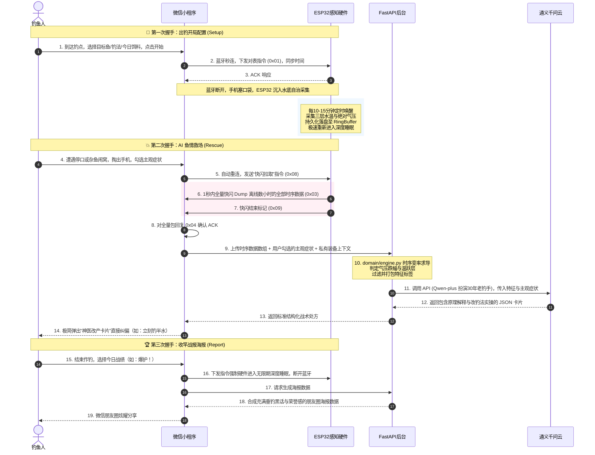

# AI 钓鱼智能系统 V2.0 🐟 
> **IoT + AI 多因子融合战术专家系统**

本项目是一套集成了 **ESP32 智能硬件 + 微信小程序前端 + Python FastAPI 物理变率与时序算法引擎 + 大语言模型（通义千问）** 的野钓智能化战术决策系统。经过 V2.0 的全面升级，系统彻底告别了传统“长驻后台的实时大屏监控”，重构为**最符合钓鱼人真实行为习惯的“三次精准握手式流式交互”**。结合极致的极低功耗策略与数字钓箱大模型自适应校验，为垂钓爱好者提供航天级的智能护航。

---

## 🌟 V2.0 核心特性

### 1. 🔋 极端续航保护 & 断电自治 (ESP32)
* **主循环睡眠调度**：抛弃了高功耗的常驻唤醒，硬件下水后会自动断开蓝牙，每 10-15 分钟由 RTC 定时器自动唤醒，极速采集后重新进入 Deep-sleep。
* **`keepalive_sleep` 小电流保活**：针对现代充电宝在电流过小时会自动关机的痛点，设计了脉冲式小电流保活技术，完美兼容常规充电宝，既省电又防关机。
* **硬件 Flash 环形缓冲区**：在固件端引入 `ring_buffer.py`，所有水文、温差与气压数据会直接持久化于 Flash（落盘为 `/ring.bin`），意外断电数据绝不丢失。

### 2. ⚡ REQ-ACK 批量快闪同步 (BLE Fast Dump)
* **快闪同步协议**：当钓鱼人再次掏出手机开屏时，小程序自动与 ESP32 重连。手机发送 `0x08` 指令，硬件在 1 秒内将离线作钓数小时收集的数百条温压时序数据全量 Dump 推送给手机（`CMD_BULK_DUMP`），通信效率提升 20 倍。
* **锁屏自治**：作钓期间，手机可以完全锁屏塞入口袋，彻底解放双手，无需担心微信小程序后台运行被系统杀掉。

### 3. 🧠 物理变率引擎与 AI 鱼情救场 (LLM Agent 深度融合)
* **硬规则与 AI 边界划分**：传统计算（如 2 小时气压变率 $\Delta P$、多层水下温跃层、溶氧估算、月相及潮汐评分）全部由本地高效的物理变率引擎（`domain/engine.py`）及 `analyzers.py` 严格运算，打上特征标签（如 `STATUS_PRESSURE_CRASH`），绝不让大模型做任何低效的数学计算。
* **老钓手 AI 处方卡片**：当遭遇鱼情停口、闹小鱼等异常时，用户在小程序“AI救场”页面轻按勾选水面主观特征（如：*有细密地星跑泡但不咬钩*），后端整合物理特征与主观表象，驱动云端通义千问 (Qwen) 扮演 **“30年华南水域硬核老钓手”**，秒级生成排版精美、满载垂钓圈黑话的结构化 **“战术处方卡片”**（例如：*表底温差大产生温跃层，底层缺氧，建议立刻推漂30cm钓离底*）。

### 4. 🎣 数字化智能钓箱 (Tackle Box) & UGC 智能核验
* **全装备链建模**：内置鱼竿（`rods.py`）、商品饵料与状态料（`baits.py`）、主线、子线双钩及浮漂等数字实体属性库。内置官方主流名竿名饵物理参数，支持一键添加经典“老三样”饵料。
* **大模型 UGC 众包资产校验**：当用户手填录入小众或最新的自定义鱼竿/饵料时，系统调用 `RodVerificationService` (基于 `qwen-plus` 配合 **Live Web-Search 实时联网搜索** 功能)，极速确认该产品是否真实存在。核验成功后自动存入全球公共数据库 `public_rods`/`public_baits` 中，支持全球钓友众包收录，供后续任何人下拉直接选择！


---

## 📂 项目结构

```text
├── esp32/                              # ── ESP32 硬件 Micropython 固件 ──
│   ├── main.py                         #   V2 硬件主循环（低功耗睡眠、心跳与感知任务调度）
│   ├── config.py                       #   全局硬件配置（引脚映射、BLE UUID、快闪指令码）
│   ├── ble/
│   │   ├── protocol.py                 #   GATT BLE 帧双向编解码器 (支持 0x08 快闪指令)
│   │   └── service.py                  #   GATT 蓝牙连接管理与 Fast Dump 离线分发服务
│   ├── storage/
│   │   └── ring_buffer.py              #   基于 Flash 持久化的环形缓冲区（防断电丢失）
│   └── utils/
│       └── keepalive.py                #   充电宝脉冲保活防关机发生器
│
├── miniprogram/                        # ── 微信小程序前端（微信开发者工具） ──
│   ├── app.json                        #   三屏握手路由配置
│   ├── pages/
│   │   ├── setup/                      #   1️⃣ 第一次握手：出钓开局配置（目标鱼/钓法/饵料/对时）
│   │   ├── rescue/                     #   2️⃣ 第二次握手：BLE 快闪同步、AI 鱼情救场与处方卡片
│   │   ├── report/                     #   3️⃣ 第三次握手：全天传感器趋势复盘、战报荣誉海报分享
│   │   └── settings/                   #   系统设置与 V1 实时监控大屏入口备份
│   └── utils/
│       ├── ble.js                      #   微信小程序端 BLE 快闪协议状态机
│       └── api.js                      #   V2 后端 HTTP 异步请求封装
│
├── domain/                             # ── 后端业务逻辑·DDD 核心领域层 ──
│   ├── services.py                     #   核心业务大管家：多因子融合钓鱼预测算法
│   ├── engine.py                       #   物理变率引擎：计算水温跃层分层、气压跌幅、时序求导
│   ├── analyzers.py                    #   时序分析工具库：多窗口气压抖动、水温应激速率计算
│   ├── verification.py                 #   UGC 装备资产大模型核验服务（基于 qwen-plus + 联网搜索）
│   ├── rods.py / baits.py              #   经典商业鱼竿/饵料多维物理特性配置库
│   ├── solunar.py                      #   月相与 solunar 理论评分计算器（大口/小口黄金期估算）
│   ├── weather.py / lbs.py             #   和风天气 / 腾讯位置服务（LBS）第三方 API 对接服务
│   ├── prescription.py                 #   大语言模型 AI 处方生成器（通义千问 DashScope 接入）
│   ├── poster.py                       #   朋友圈 Canvas 长图海报动态数据计算器
│   ├── prompts.py                      #   硬核老钓手 System Prompt 专家设定
│   ├── symptom_tags.py / tags.py       #   主观水面症状 / 客观环境战术标签枚举
│   ├── value_objects.py                #   DDD 领域值对象（传感器时序、预测结果实体）
│   ├── time_utils.py                   #   垂钓时段（早口、午休、傍晚）、出钓季节与时序判定
│   └── constants.py                    #   全鱼种（鲫/鲤/草/非/鲮）生理适温与气温一票否决阈值
│
├── infrastructure/                     # ── 后台服务端·数据库及基础设施层 ──
│   ├── database.py                     #   SQLAlchemy 引擎配置（支持 SQLite 与 MySQL 自适应）
│   └── models.py                       #   数据库物理表映射（用户、时序记录、预测日志、私有/公有钓箱）
│
├── deploy/                             # ── 生产部署运维配置 ──
│   ├── fishapp.service                 #   Linux Systemd 服务配置文件
│   ├── nginx-fishapp.conf              #   Nginx 反向代理与 SSL 配置
│   └── migrations.sql                  #   数据库物理表迁移/建表 SQL
│
├── server.py                           #   FastAPI 服务主入口（提供 RESTful APIs）
├── init_db.py                          #   数据库物理建表及自动初始化脚本
├── migrate_v2.py                       #   数据库迁移脚本
└── requirements.txt                    #   后端三方依赖列表
```

---

## 🔗 V2.0 业务流：三次精密握手



---

## 🗄️ 数据库设计与数字化装备库

系统使用 **SQLAlchemy** 进行了高内聚的数据库物理表设计，默认采用轻量化 **SQLite (`diaoyu.db`)** 进行快速开发和本地测试，同时支持在 `.env` 中简单配置一行 `DATABASE_URL` 自动迁移至 **MySQL**。

### 1. 📋 核心业务物理表
* **`users`**：微信用户表，保存微信唯一 OpenID 及用户活跃时间。
* **`sensor_records`**：用户上传的传感器历史数据流水表。支持存储三层水温（水底、中层、水面）及本地绝对气压。
* **`prediction_history`**：预测历史日志表。完整存储每一次请求时的天气快照、月相、标签及 AI 建议，形成用户的 **“数字钓鱼日记”**。
* **`fishing_sessions`**：出钓会话表。当断开设备时，自动聚合该次出钓的全部传感器时序，统计水温最低/最高值、起始/结束气压、气压全天走势，推荐最佳鱼种。

### 2. 🧰 数字化装备钓箱 (UGC 大模型核验流)
为了让 AI 专家拥有精准的“战术上下文”，设计了完整的数字化钓箱数据库：
* 装备物理表：**`user_rods`** (鱼竿)、**`user_mainlines`** (主线)、**`user_subline_hooks`** (子线双钩)、**`user_floats`** (浮漂)、**`user_baits`** (饵料)。
* 全球公共共享数据库：**`public_rods`** / **`public_baits`**，用于全球众包收录。
* **🧠 UGC 大模型核验工作流 (P0 核心)**：
  ```text
  用户手填新竿/饵料 ──> 触发 [RodVerificationService] ──> 调用通义千问 (qwen-plus) + 联网搜索 
                                                                    │
     ┌─────────────────────── 校验失败（判定非真实装备或乱码） ◄─────┤
     │                                                              │ 校验通过
     ▼                                                              ▼
  返回错误提示，拦截录入                                写入 [user_rods] 钓箱并自动同步至
                                                     [public_rods] 公共库，供全网共享！
  ```

---

## 🔌 硬件参数与 BLE 快闪交互协议

硬件采用 ESP32 BLE 作为 GATT 服务端，定义了极简的特征值，并在 V2 中重构为 **GATT 批量快闪同步协议**：

| CMD | 方向 | 名称 | 描述 |
|:---:|:---:|:---:|:---|
| `0x01` | 小程序 → ESP32 | **对表指令** | 同步 Unix 时间戳，对齐时序基准 |
| `0x02` | ESP32 → 小程序 | **实时数据帧** | 可选，供 V1 仪表盘展示实时变化 |
| `0x03` | ESP32 → 小程序 | **历史数据帧** | 快闪同步过程中批量分发缓冲区里的记录帧 |
| `0x04` | 小程序 → ESP32 | **同步确认 ACK** | 接收成功应答，硬件据此滑动发送游标 |
| `0x08` | 小程序 → ESP32 | **快闪拉取** | V2 专属，全量请求所有离线历史数据 |
| `0x09` | ESP32 → 小程序 | **快闪结束** | V2 专属，告知小程序 Dump 过程完成，准备整体 ACK |
| `0x0A` | 小程序 → ESP32 | **切换实时** | 恢复 Notify 实时推送，退出低功耗快拉模式 |

> **🚀 V2 协议效率优化说明**：
> 在 V1 版本中，每次发送 `0x03` 都必须等待小程序的 `0x04` 确认（单向停等协议），耗时严重。
> V2 版本重构为**批量管道快拉模式**：收到 `0x08` 后，ESP32 开启高速连发，全速推送 `0x03`，完全不等待 `0x04`；当数据全部发完时，发送一次 `0x09`，由小程序端一次性统一校验应答，在 1s 内即可完成数百条历史数据的同步。

---


## 🚀 快速开始与部署指南

### 1. 💻 服务端环境配置与运行

#### 第一步：安装依赖
推荐使用 Python 3.9+，通过 pip 安装核心三方库：
```bash
pip install -r requirements.txt
```

#### 第二步：配置环境变量
复制 `.env.example` 并重命名为 `.env`，填入您的通义千问 API 密钥及微信小程序配置：
```bash
# 拷贝配置文件
cp .env.example .env

# 编辑 .env 文件
# DASHSCOPE_API_KEY=your_real_dashscope_key
```

#### 第三步：自适应物理建表与初始化
系统提供了一键初始化脚本，运行后将自动建立数据库物理表（默认在项目根目录生成本地 `diaoyu.db` SQLite 文件），并自适应录入主流鱼竿与饵料的基础种子数据：
```bash
python init_db.py
```

#### 第四步：启动服务 (FastAPI)
* **开发环境运行**：
  ```bash
  python server.py
  ```
  启动后，可直接访问本地的 Swagger API 交互文档：[http://127.0.0.1:8000/docs](http://127.0.0.1:8000/docs)。

* **生产环境运行 (Gunicorn)**：
  配合 `gunicorn.conf.py` 配置文件，在 Linux 服务器上以高并发多进程模式运行：
  ```bash
  gunicorn server:app -c gunicorn.conf.py
  ```

---


### 2. 📱 微信小程序开发与联调
1. 安装微信开发者工具，点击“导入项目”，选择导入 `miniprogram/` 目录。
2. 修改 `miniprogram/app.js` 中的 `apiBaseUrl` 为您刚才部署的 FastAPI 接口服务器地址。
3. 开启“不校验合法域名、web-view（业务域名）、TLS版本以及HTTPS证书”选项以支持本地开发调试。

---

### 3. 🪵 ESP32 感知终端固件上传
1. 使用 Thonny IDE 或 `ampy`，将整个 `esp32/` 目录中的全部文件上传至 ESP32 硬件文件系统的根目录下。
2. 硬件上电后，主板将自适应初始化并在本地建立 `/ring.bin` 文件。

---

### 4. 🛡️ 生产环境运维部署 (Linux Nginx)

#### 注册 Systemd 守护进程
将项目下的 `deploy/fishapp.service` 拷贝至系统的 systemd 目录，并使能开机自启：
```bash
sudo cp deploy/fishapp.service /etc/systemd/system/
sudo systemctl daemon-reload
sudo systemctl enable fishapp
sudo systemctl start fishapp
```

#### Nginx 反向代理与 SSL
将项目下的 `deploy/nginx-fishapp.conf` 复制到 Nginx 的 `sites-enabled` 目录下，配置好您的 HTTPS 域名证书，平滑重启 Nginx 服务：
```bash
sudo cp deploy/nginx-fishapp.conf /etc/nginx/sites-enabled/
sudo nginx -s reload
```
项目线上演示接口默认通过 `https://ks.gzbaoge.com` 进行反向代理接入。

---

### 5. 📚 大师知识库内容更新

项目内置了《大师战术与配方百科全书》结构化知识库（322 条秘籍），支持按鱼种 / 季节 / 水温 / 气压多维检索，为 AI 救场和预测接口提供战术参考。若需新增或修改大师知识内容，操作如下：

#### 第一步：编辑原始语料
修改项目根目录下的 `大师战术与配方百科全书.md`，按现有格式追加新的战术 / 配方内容。

#### 第二步：重新清洗生成知识库
在项目根目录执行清洗脚本，自动将 Markdown 语料解析为结构化 JSONL：
```bash
python scripts/build_master_kb.py
```
脚本会自动读取 `大师战术与配方百科全书.md`，清洗后覆盖输出到 `data/master_kb.jsonl`，并在控制台打印统计信息（总条数 / 按来源 / 按季节）。

#### 第三步：重启后端服务
重启 FastAPI 服务进程，`MasterKBRetriever` 单例会自动重新加载更新后的 JSONL 文件，新知识即刻生效。

> **提示**：清洗脚本会自动处理解析和过滤，只要新增内容遵循现有的 Markdown 格式即可，无需修改任何代码。

---

## 👨‍💻 核心算法贡献者说明
本系统由 domain/services.py 中的核心物理变率引擎及大模型战术专家协同驱动。若您在野钓中遇到了气压骤降或水体严重温跃层，欢迎将离线数据回传至公共众包库，帮助我们共同优化“华南水域 30 年老钓手”的大模型提示词字典。祝大家出钓顺利，绝不空军！ 🐟