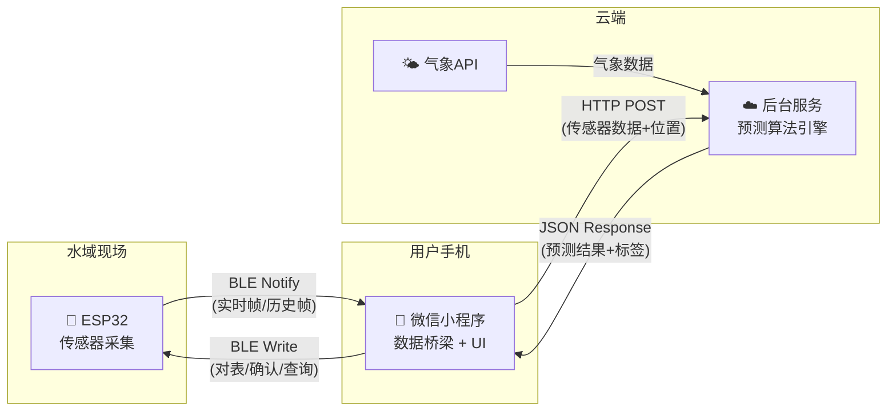
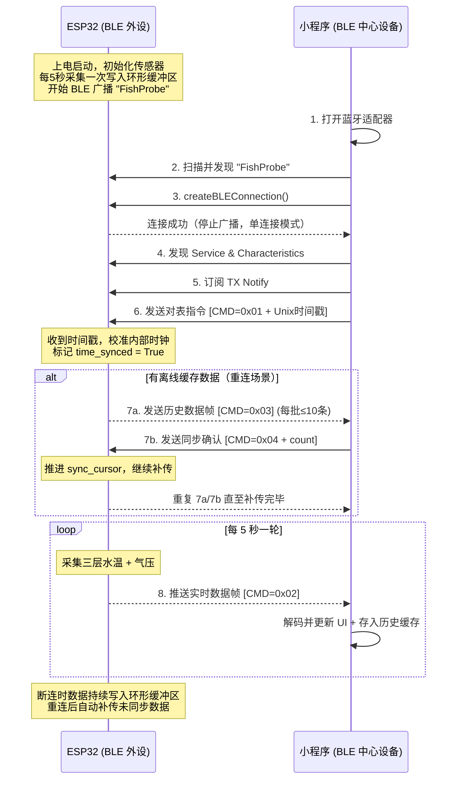
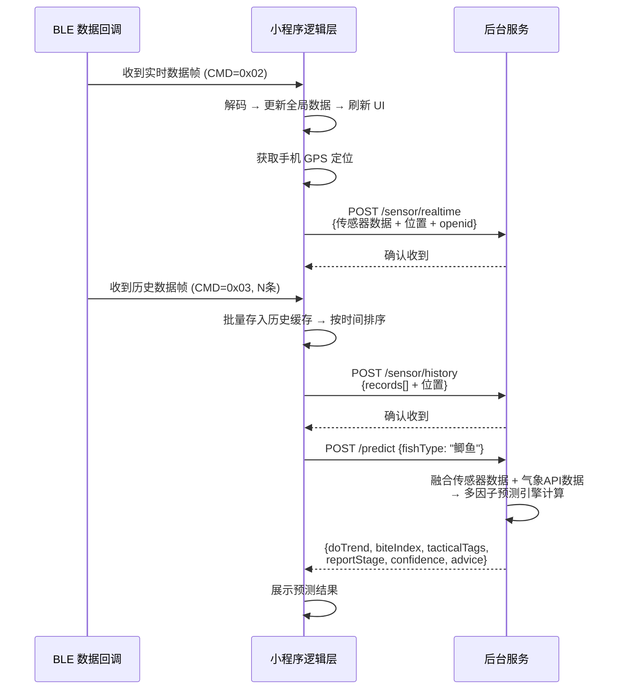
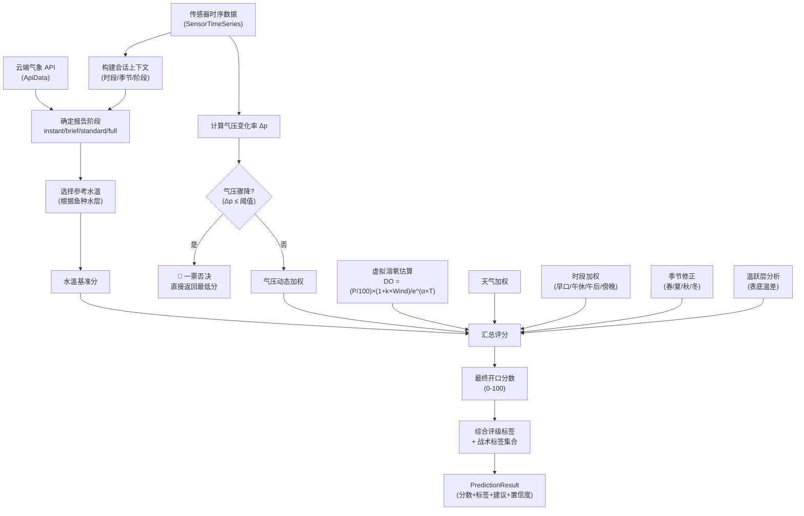
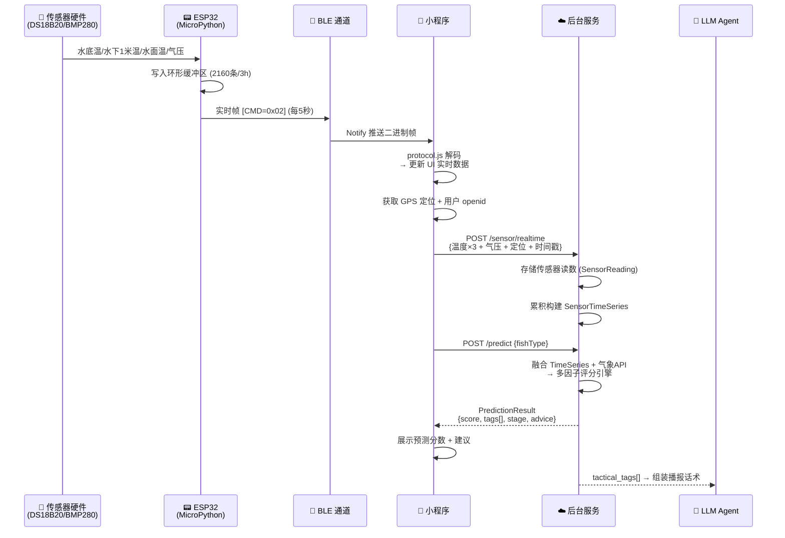

# AI 钓鱼多因子融合预测系统 🐟

本项目是一套完整的**IoT + AI 钓鱼预测系统**，由三个端组成：

| 端 | 技术栈 | 运行环境 | 职责 |
|---|---|---|---|
| **ESP32 硬件端** | MicroPython | ESP32 开发板 | 传感器数据采集 + BLE 广播 |
| **微信小程序端** | 微信原生框架 (JS/WXML/WXSS) | 用户手机 | BLE 连接桥梁 + 数据展示 + 后端通信 |
| **后台服务端** | Python (DDD 架构) | 云服务器 | 核心预测算法引擎 + API 服务 |

---

## 📂 项目结构

```text
├── esp32/                          # ── ESP32 硬件端 ──
│   ├── main.py                     #   主采集-通信循环（每 5 秒一轮）
│   ├── config.py                   #   全局配置（引脚、BLE UUID、协议指令码）
│   ├── ble/
│   │   ├── protocol.py             #   BLE 二进制帧编解码（struct pack/unpack）
│   │   └── service.py              #   BLE GATT 服务管理（广播、连接、收发）
│   ├── sensors/
│   │   ├── temperature.py          #   DS18B20 三层水温采集（双总线布局）
│   │   └── pressure.py             #   BMP280 气压传感器驱动（I2C 寄存器级）
│   ├── storage/
│   │   └── ring_buffer.py          #   环形缓冲区（断连期间缓存，支持重连补传）
│   └── utils/
│       └── time_sync.py            #   时间同步管理（接收小程序校时）
│
├── miniprogram/                    # ── 微信小程序端 ──
│   ├── app.js                      #   全局入口（静默登录、BLE 权限、全局数据）
│   ├── app.json                    #   页面路由与 TabBar 配置
│   ├── app.wxss                    #   全局样式
│   ├── pages/
│   │   ├── index/                  #   「实时监测」页面（连接按钮 + 实时数据展示）
│   │   └── history/                #   「趋势分析」页面（历史数据列表 + 统计摘要）
│   └── utils/
│       ├── ble.js                  #   BLE 连接管理器（扫描→连接→对表→收发）
│       ├── protocol.js             #   BLE 帧编解码（与 ESP32 protocol.py 对齐）
│       └── api.js                  #   后端 HTTP API 通信封装
│
├── domain/                         # ── 后台服务端 · 领域核心 ──
│   ├── value_objects.py            #   值对象（HardwareData/SensorReading/PredictionResult）
│   ├── services.py                 #   核心预测服务（单帧/时序两种模式）
│   ├── constants.py                #   领域常量（鱼种配置、物理补偿系数、分数阈值）
│   ├── tags.py                     #   战术标签枚举（40+ 标签供 LLM 组装话术）
│   ├── analyzers.py                #   时序分析器（温度趋势、气压趋势、温跃层）
│   └── time_utils.py              #   时段/季节/阶段判定工具
│
├── main.py                         #   运行演示入口（模拟数据 + 渐进式报告演示）
├── tests/                          #   单元测试 + BLE 协议测试 + 端到端数据流测试
└── pytest.ini
```

---

## 🔗 三端交互逻辑

### 总体架构



---

### 交互流程一：BLE 连接与数据采集（ESP32 ↔ 小程序）

ESP32 与小程序之间通过 **BLE 4.0 GATT** 协议通信，使用自定义二进制帧格式（小端序），帧结构为 `[1字节 CMD] + [N字节 PAYLOAD]`。

#### BLE 通信参数

| 参数 | 值 |
|---|---|
| 设备名称 | `FishProbe` |
| Service UUID | `12345678-1234-5678-1234-56789abcdef0` |
| TX Characteristic (ESP32 → 小程序) | `...def1` (Notify + Read) |
| RX Characteristic (小程序 → ESP32) | `...def2` (Write) |

#### 指令码定义

| CMD | 方向 | 名称 | Payload |
|---|---|---|---|
| `0x01` | 小程序 → ESP32 | 对表指令 | 4字节 Unix 时间戳 |
| `0x02` | ESP32 → 小程序 | 实时数据帧 | timestamp(4) + t_bottom(4) + t_mid(4) + t_surface(4) + p_local(4) = 20字节 |
| `0x03` | ESP32 → 小程序 | 历史数据帧 | count(2) + N×20字节 |
| `0x04` | 小程序 → ESP32 | 同步确认 | confirmed_count(2) |
| `0x05` | 小程序 → ESP32 | 状态查询 | 无 |
| `0x06` | ESP32 → 小程序 | 状态回复 | capacity(2) + count(2) + unsent(2) + total_written(4) |

#### 完整连接流程



#### ESP32 主循环逻辑（每 5 秒）

1. **采集** — 读取三层水温（DS18B20 双总线：水底 + 水下1米 + 水面）和气压（BMP280 I2C）
2. **存储** — 写入环形缓冲区（容量 2160 条 = 3 小时数据）
3. **发送策略**：
   - ✅ 已连接 + 已对表 → 优先补传历史数据，历史清空后推送实时帧
   - ⏳ 已连接 + 未对表 → 等待小程序发送对表指令
   - ❌ 未连接 → 数据留在缓冲区，等待重连

#### 离线容灾机制

ESP32 内置环形缓冲区，BLE 断连期间数据持续采集存储。缓冲区维护独立的 **写入游标** 和 **同步游标**，重连后根据游标差值精准补传丢失的数据，无需全量重传。

---

### 交互流程二：数据上报与预测（小程序 ↔ 后台服务）

小程序通过 **HTTP REST API** 与后台服务交互，扮演"数据桥梁"角色——将 ESP32 的本地传感器数据附加位置和用户信息后转发至云端。

#### API 接口列表

| 接口 | 方法 | 用途 | 请求数据 |
|---|---|---|---|
| `/api/login` | POST | 小程序静默登录 | `{ code }` |
| `/api/sensor/realtime` | POST | 上报实时传感器数据 | `{ timestamp, tBottom, tMid, tSurface, pLocal, location }` |
| `/api/sensor/history` | POST | 批量上报历史数据 | `{ records[], location }` |
| `/api/predict` | POST | 获取钓鱼预测结果 | `{ fishType }` |
| `/api/predict/report` | POST | 获取渐进式预测报告 | `{ fishType }` |
| `/api/sessions` | GET | 查询历史钓鱼会话 | `?limit=10` |

所有请求自动携带 `X-OpenID` Header 用于用户身份识别。

#### 数据上报流程



---

### 交互流程三：预测引擎计算（后台服务内部）

后台核心是基于 **领域驱动设计（DDD）** 构建的多因子融合预测引擎，支持两种预测模式：

| 模式 | 入参 | 适用场景 |
|---|---|---|
| **单帧快照** `predict()` | HardwareData + ApiData | 向后兼容，简单快速 |
| **时序数据** `predict_from_series()` | SensorTimeSeries + ApiData | 完整功能，渐进式报告 |

#### 预测引擎计算链路



#### 渐进式报告阶段

系统根据已累积的传感器数据时长，自动切换报告阶段并逐步启用更多分析维度：

| 阶段 | 数据时长 | 置信度 | 启用的分析特征 |
|---|---|---|---|
| `instant` | 刚连接 | ~30% | 水温基准分 + 天气 + 时段 + 季节 |
| `brief` | ≥5 分钟 | ~50% | + 气压趋势 + 溶氧估算 |
| `standard` | ≥10 分钟 | ~70% | + 温度趋势 + 温跃层分析 |
| `full` | ≥30 分钟 | ~90% | + 深度鱼情趋势判断 |

#### 战术标签系统

预测引擎产出的 **战术标签 (Tactical Tags)** 是供下游 LLM Agent 组装人类可读话术的结构化信号，覆盖以下维度：

- 🌡️ 水温状态（最佳/可钓/极热/极冷/上升/下降/逆温）
- 📊 气压状态（上升/稳定/缓降/骤降）
- 💧 溶氧状态（健康/危险）
- ☁️ 天气状态（有利/不利）
- ⏰ 时段标签（早口黄金/午休/午后开口/傍晚爆口）
- 🍂 季节标签（春季回暖/夏季酷热/秋季降温/冬季严寒）
- 🎯 战术建议（钓中层/钓离底/鱼上浮）
- 📈 趋势判断（鱼情转好/鱼情转差）
- ⭐ 综合评级（极佳/良好/一般/差/一票否决）

---

## 🔄 端到端数据流总览



---

## 🚀 快速开始

### 1. 运行预测引擎演示（后台服务端）

```bash
# 默认时序模式，目标鱼种：鲫鱼
python main.py

# 指定鱼种和模拟时长
python main.py --fish 鲈鱼 --duration 60

# 单帧快照模式（向后兼容）
python main.py --mode legacy

# 查看可选鱼种
python main.py --help
```

### 2. ESP32 固件烧录

将 `esp32/` 目录下的所有文件通过 Thonny 或 ampy 上传至 ESP32 开发板，设备上电后自动开始采集并广播 BLE。

### 3. 小程序开发

使用微信开发者工具导入 `miniprogram/` 目录，修改 `app.js` 中的 `apiBaseUrl` 为实际后端地址后即可调试。

---

## ⚙️ 进阶可扩展性

### 鱼种适配

在 `domain/constants.py` 中通过 `FishSpeciesProfile` 配置不同鱼种的最佳水温区间、水层偏好等参数：

```python
from domain.constants import FishSpeciesProfile
from domain.services import FishingPredictionService

trout_profile = FishSpeciesProfile(
    name="虹鳟",
    optimal_temp=(10.0, 18.0),
    tolerable_temp=(4.0, 22.0),
    water_layer="mid",  # 中层鱼
)
custom_service = FishingPredictionService(fish_profile=trout_profile)
```

### 算法参数热更新

所有评分权重、物理系数、阈值均通过配置类注入，支持不停机动态调参。

### 后端框架集成

`domain/` 模块为纯 Python，零外部依赖，可直接被 Django/FastAPI 的应用服务层导入调用。建议在应用层完成数据存储、API 鉴权、气象数据获取后，将数据封装为 `SensorTimeSeries` + `ApiData` 传入预测引擎。