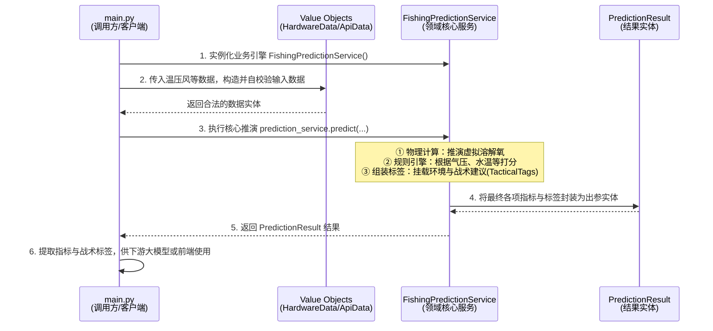

# AI 钓鱼多因子融合预测模型 🐟

这是一个基于**领域驱动设计（DDD）**思想构建的 AI 钓鱼预测核心算法库。本模块通过融合来自边缘硬件的实测数据（如水温、本地气压）与云端气象数据（风速、天气趋势），运用多因子物理模型与动态加权算法，对“虚拟溶解氧（DO）”和目标鱼种的“开口指数”进行智能评估。

该模块不仅输出具体的预测得分，还会产生供下游 AI Agent 组装话术的**战术标签 (Tactical Tags)**。由于本模块完全采用纯面向对象（OOP）编写，无外部框架依赖，非常容易集成到 Django、FastAPI 或其他任何 Python 后端服务中。

---

## 📂 项目结构

```text
├── main.py            # 运行演示入口脚本 (包含直接可用的测试数据)
└── domain/
    ├── constants.py       # 领域常量与可配置项（如物理补偿系数、分数阈值）
    ├── services.py        # 核心服务层（包含多维度评分权重的计算引擎）
    ├── tags.py            # 战术标签枚举（如水温极高、气压崩溃等）
    └── value_objects.py   # 值对象层（入参：硬件与API数据 / 出参：预测评分结果）
```

---

## 🚀 特性

- **解耦设计**：纯业务逻辑，与数据库（ORM）或 Web 框架（如 Django views）分离，极其方便接入现有存量系统。
- **物理拟合推演**：结合风力增强与水温衰减系数计算**虚拟溶解氧**。
- **多维度评分体系**：综合考量水温基准分、气压变化动态加权以及异常天气加权。
- **安全与保护机制**：包含“一票否决”系统（例如气压在 2 小时内断崖式下跌，自动短路打最低分）。
- **完全类型提示 (Type Hints)**：代码具备 100% 的 Python 类型注解，现代 IDE 支持友好。

---

## 🛠️ 如何集成与使用

本体系为纯 Python 模块，Python 版本建议 >= 3.8。无需安装额外的第三方包。

### 1. 快速入门与运行演示

本项目自带了一个完整的运行演示脚本 `main.py`。该脚本中准备了模拟的硬件和天气数据，并在 Windows 终端下配置了强制 UTF-8 输出以避免表情符号导致的乱码报错。

**运行方法**：
直接在项目根目录下，使用终端运行以下命令：

```bash
python main.py
```

**预期的控制台输出**：
```text
========================================
🎣 AI 钓鱼预测核心算法 - 运行演示
========================================

[ 系统 ] 正在从边缘传感设备及云端气象API获取数据...
  -> 水温: 22.5℃ | 气压: 1008.5hPa | 气压变化: +1.2hPa/2h
  -> 风速: 2.5m/s | 天气: sunny

[ 系统 ] 开始多因子数据融合计算与推演...

========================================
🎯 最终预测结果
========================================
💧 虚拟溶解氧指标  : 4.76 mg/L
⭐ 最终综合开口分数: 91 / 100
🏷️  触发的战术标签集合:
    ✅ STATUS_TEMP_OPTIMAL
    ✅ STATUS_PRESSURE_RISING
    ✅ STATUS_DO_HEALTHY
    ✅ STATUS_WEATHER_FAVORABLE
    ✅ RATING_EXCELLENT

(开发提示：您可以将上述标签通过系统拼接后，发送给 LLM 生成人类播报语音)
```

如果您想测试不同的钓鱼环境（比如模拟台风天、或者气压断崖式下跌的一票否决场景），可以直接打开修改 `main.py` 中的 `hardware_data` 和 `api_data` 块并重新运行。

### 2. 核心调用链路图 (main.py)

`main.py` 完整演示了如何从外部客户端调用该领域驱动（DDD）架构的模型，其数据流向与调用链路如下：



### 3. 在 Django / FastAPI 中的应用架构思路

我们建议把外部系统的繁琐数据（如 ORM 获取数据库传感器记录，或使用 requests 请求外部天气平台）放在**应用服务层 (Application Service)**，获取数据后组装成纯净的 `HardwareData` 和 `ApiData`，然后灌入本引擎。引擎测算完成后将返回的结果中的 `result.tactical_tags` 输送给大语言模型（LLM）等 Agent 来组装话术，或直接响应给前端小程序。

---

## ⚙️ 进阶可扩展性 (Extension)

### 对不同鱼种的适配
目前底层基准逻辑针对水温定义了相应的适宜区间。在 `domain/constants.py` 中有 `FishSpeciesProfile`：
```python
from domain.constants import FishSpeciesProfile
from domain.services import FishingPredictionService

# 如果需要适配耐寒冷水鱼，可定义新配置
trout_profile = FishSpeciesProfile(
    name="虹鳟",
    optimal_temp=(10.0, 18.0),
    tolerable_temp=(4.0, 22.0)
)
# 传入针对特别鱼种的配置即可无缝运作！
custom_service = FishingPredictionService(fish_profile=trout_profile)
```

### 算法参数的热更新支持
如果模型接入线上后需要调参（比如降低扣分严厉度），只需用一个配置加载器替代默认参数类传入给系统的 `__init__` 中即可，实现不停机调整预测参数。


从小程序端会传来
1.三个温度值 
2.一个气压值
以上是从esp32每隔5秒获取一次
3.时间戳
4.定位数据
5.用户信息