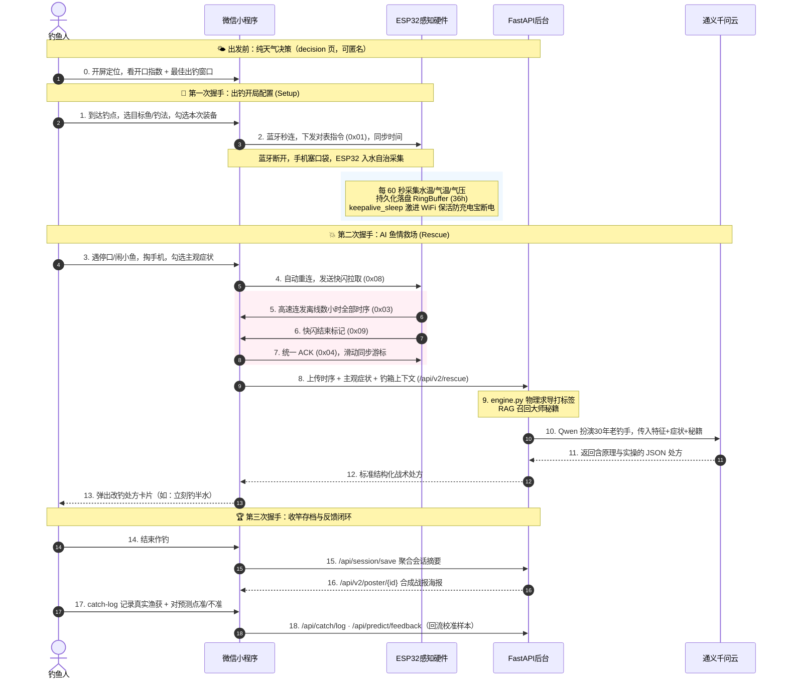

# AI 钓鱼智能系统 V2.0 🐟
> **IoT + AI 多因子融合战术专家系统**

本项目是一套集成了 **ESP32 智能硬件 + 微信小程序前端 + Python FastAPI 物理变率与时序算法引擎 + 大语言模型（通义千问）** 的野钓智能化战术决策系统。它彻底告别传统「长驻后台实时大屏监控」，重构为**最符合钓鱼人真实行为习惯的「三次握手 + 反馈闭环」流式交互**：出发前看天气、开局对表、入水自治采集、掏手机一秒同步数小时数据 + AI 救场、收竿存档复盘。

---

## 🌟 核心特性

### 1. 🔋 充电宝供电保活 & 断电自治 (ESP32)
* **常驻采集 + 切片保活**：硬件下水后断开蓝牙，每 **60 秒**采集一条数据。主循环用 `keepalive_sleep` 替代普通睡眠——将长睡眠切成 ~2 秒片段，片段间插入 CPU 脉冲并触发 WiFi 全信道扫描。
* **充电宝小电流防关机**：普通充电宝在负载电流过小（约 50~100mA）时会自动断电。`utils/keepalive.py` 采用**激进 WiFi 近乎常开**策略把平均电流稳定抬到 ~120~180mA，压住充电宝的小电流保护阈值。（若个别充电宝阈值仍偏高，最终方案是硬件加一颗假负载电阻。）
* **Flash 环形缓冲区**：`storage/ring_buffer.py` 将水温/气温/气压数据持久化于 Flash（落盘 `/ring.bin`，16 字节/记录，容量 **2160 条 ≈ 36 小时**），意外断电数据不丢失，支持独立的写入游标与同步游标实现精准补传。

### 2. ⚡ 批量快闪同步 (BLE Fast Dump)
* **快闪同步协议**：钓鱼人再次掏出手机，小程序自动与 ESP32 重连，发送 `0x08`，硬件**高速连发 `0x03` 历史帧不停等**，发完一个 `0x09` 结束标记，小程序统一回一次 `0x04` ACK 并滑动同步游标，秒级完成数小时数据同步（相较 V1 逐帧停等效率大幅提升）。
* **锁屏自治**：作钓期间手机可完全锁屏塞入口袋，解放双手，无需担心小程序后台被系统杀掉——数据都在硬件 RingBuffer 里。

### 3. 🧠 物理变率引擎与 AI 鱼情救场 (LLM 深度融合)
* **乘性归一开口指数**：`domain/services.py` 用「水温隶属度 × 气压系数 × ∏环境系数」的乘性归一模型合成 0~100 开口指数，利好因子边际递减、不利因子乘性压制，解决旧加法模型的结构缺陷。多因子涵盖水温（高斯隶属度）、气压（2h 变率 + 15min 短窗 + 绝对值合并封顶 + 骤降一票否决软折减）、溶氧（Benson & Krause 查表 + 气压/风力修正 + 高温折减）、时段、季节、温跃层、温度速率、月相 Solunar、风向（季节交叉）、湿度、风力、天气转折（雨后初晴/末日口/降温）。
* **硬规则与 AI 边界划分**：所有数学运算由本地引擎严格完成并打**特征标签**（如 `STATUS_PRESSURE_CRASH`），绝不让大模型做数学计算。
* **老钓手 AI 处方卡片**：遇停口/闹小鱼时，用户在「AI 救场」页勾选主观症状（跑泡不咬、杂鱼截口、突然停口、鱼层上浮…），后端整合物理特征 + 主观表象 + 用户钓箱 + RAG 召回的大师秘籍，驱动通义千问扮演「30 年硬核老钓手」，秒级生成结构化「战术处方卡片」（如：底层缺氧，立刻推漂 30cm 钓离底）。

### 4. 📚 大师知识库 RAG
* `domain/master_kb.py` 的 `MasterKBRetriever` 单例从 `data/master_kb.jsonl` 按（鱼种/季节/气温/气压状态）召回 Top-K 大师战术秘籍：预测接口返回 `master_tips` 供前端展示，救场接口注入 LLM prompt 提升处方专业度。语料源为根目录《大师战术与配方百科全书.md》，经 `scripts/build_master_kb.py` 清洗为结构化 JSONL。

### 5. 🎣 数字化智能钓箱 & UGC 智能核验
* **全装备链建模**：鱼竿、主线、子线双钩、浮漂、饵料五类数字实体，支持一键添加经典「老三样」。预测时按目标鱼种/天气/温度从用户钓箱中**精准匹配最优装备**，并优先以「本次出钓勾选」的装备为范围。
* **大模型 UGC 众包核验**：用户手填自定义鱼竿/饵料时调用 `RodVerificationService`（`qwen-plus` + **联网搜索**）核验真实性。核验通过自动收录到公共库 `public_rods`/`public_baits`（`is_verified=1` 全球可见；异常兜底放行的标记为待审 `is_verified=0`，防止脏数据污染下拉库），供全网钓友众包复用。

### 6. 📈 反馈闭环与渔获校准
* **真实渔获记录**：`catch-log` 页记录「实际钓到了什么」，连同当时预测开口指数/环境快照存入 `catch_logs`。
* **预测准不准轻反馈**：用户对某次预测点「准/不准」存入 `prediction_feedback`。
* **有界校准**：`domain/calibration.py` 的 `CatchCalibrator` 加载离线脚本 `scripts/calibration_report.py` 聚合出的 `data/calibration_stats.json`，按开口指数分箱的「真实有口率」对预测分数做**有界微调（±10 分以内）**；全体样本 < 30 或文件缺失时自动退化为 no-op，绝不让小样本噪声污染预测。

### 7. 🔐 安全与防护
* **会话令牌鉴权**：登录时服务端签发随机 `token`（30 天 TTL），openid **仅留服务端、不下发前端**；私有接口通过 `X-Token` 头解析用户，杜绝明文 openid 越权。
* **LLM 成本防护**：AI 救场、装备联网核验等高成本接口需登录态，并按用户滑动窗口限流（`infrastructure/rate_limit.py`，默认 10 次/小时）。

---

## 📂 项目结构

```text
├── esp32/                              # ── ESP32 硬件 MicroPython 固件 ──
│   ├── main.py                         #   主循环：每60s采集、keepalive_sleep 充电宝保活、BLE快闪 tick
│   ├── config.py                       #   全局配置（引脚 / 采样间隔 / BLE UUID / 指令码）
│   ├── sensors/
│   │   ├── temperature.py              #   DS18B20 水温（单探头）
│   │   └── pressure.py                 #   BMP280 气温 + 本地气压（I2C）
│   ├── ble/
│   │   ├── protocol.py                 #   GATT BLE 帧双向编解码器（含 0x08 快闪指令）
│   │   └── service.py                  #   GATT 连接管理与 Fast Dump 离线分发
│   ├── storage/
│   │   └── ring_buffer.py              #   Flash 持久化环形缓冲（36h / 防断电 / 双游标补传）
│   └── utils/
│       ├── keepalive.py                #   充电宝激进 WiFi 保活防关机
│       └── time_sync.py                #   对表时间同步
│
├── miniprogram/                        # ── 微信小程序前端（微信开发者工具） ──
│   ├── app.json                        #   页面路由 + tabBar（开始作钓 / AI救场 / 装备库）
│   ├── pages/
│   │   ├── setup/                      #   1️⃣ 第一次握手：出钓开局（目标鱼/钓法/装备/对时）
│   │   ├── rescue/                     #   2️⃣ 第二次握手：BLE 快闪同步 + AI 鱼情救场处方
│   │   ├── decision/                   #   出发前纯天气决策（开口指数 + 最佳出钓窗口）
│   │   ├── index/                      #   实时监测大屏（BLE 实时数据 + 简要预测）
│   │   ├── catch-log/                  #   渔获记录（反馈闭环）
│   │   ├── history/                    #   全天传感器趋势复盘（ECharts）
│   │   ├── inventory/ + add-*/         #   数字钓箱与各品类录入页
│   │   └── settings/ · privacy/        #   设置 / 隐私
│   └── utils/
│       ├── ble.js                      #   BLE 快闪协议状态机
│       ├── protocol.js                 #   帧编解码
│       ├── api.js                      #   后端 HTTP 请求封装（自动带 X-Token）
│       └── tagMap.js                   #   战术标签中文翻译
│
├── domain/                             # ── 后端业务逻辑·DDD 核心领域层 ──
│   ├── services.py                     #   核心：乘性归一多因子开口指数预测服务
│   ├── engine.py                       #   物理变率引擎：气压趋势 / 温跃层 / 均值（救场用）
│   ├── analyzers.py                    #   时序分析：多窗口气压变率、温度趋势、温跃层指数
│   ├── forecast.py                     #   逐时/3天鱼情预报与最佳窗口
│   ├── constants.py                    #   9 鱼种生理画像 + 各评分模块配置 + 溶氧查表
│   ├── value_objects.py                #   DDD 值对象（传感器读数/时序/预测结果/会话上下文）
│   ├── tags.py                         #   客观环境战术标签枚举
│   ├── time_utils.py                   #   时段/季节/报告阶段/置信度判定
│   ├── solunar.py                      #   月相与 Solunar 理论评分（零依赖天文算法）
│   ├── weather.py / lbs.py             #   和风天气（带缓存）/ 腾讯 LBS 逆地址解析
│   ├── prescription.py / prompts.py    #   AI 处方生成器（含 RAG）/ 老钓手 System Prompt
│   ├── master_kb.py                    #   大师知识库 RAG 检索器
│   ├── verification.py                 #   UGC 装备大模型核验（qwen-plus + 联网搜索）
│   ├── inventory.py                    #   数字钓箱装备实体与聚合
│   ├── calibration.py                  #   渔获反馈有界校准
│   └── poster.py                       #   战报海报数据生成
│
├── infrastructure/                     # ── 数据库与基础设施层 ──
│   ├── database.py                     #   SQLAlchemy 引擎（SQLite / MySQL 自适应）
│   ├── models.py                       #   物理表映射（用户/时序/预测/会话/钓箱/渔获/反馈）
│   └── rate_limit.py                   #   进程内滑动窗口限流器
│
├── scripts/
│   ├── build_master_kb.py              #   《百科全书.md》→ master_kb.jsonl 清洗脚本
│   └── calibration_report.py           #   渔获样本聚合 → calibration_stats.json
│
├── deploy/                             # ── 生产部署运维配置 ──
│   ├── fishapp.service                 #   systemd 服务
│   ├── nginx-fishapp.conf              #   Nginx 反向代理 + SSL
│   └── migrations.sql                  #   建表/迁移 SQL
│
├── server.py                           #   FastAPI 服务主入口（RESTful API）
├── init_db.py                          #   建表与种子数据初始化
├── migrate_v2.py / migrate_*.py        #   数据库迁移脚本
└── requirements.txt                    #   后端依赖
```

---

## 🔗 业务流：三次握手 + 反馈闭环



---

## 🗄️ 数据库设计

默认 **SQLite (`diaoyu.db`)**，在 `.env` 配置 `DATABASE_URL` 即自动切换 **MySQL**（`infrastructure/database.py` 自适应）。

### 核心业务表
* **`users`**：微信用户。保存 OpenID（仅服务端）、随机会话令牌 `session_token` 及过期时间。
* **`sensor_records`**：传感器时序流水。`t_water`（DS18B20）+ `t_air`/`p_local`（BMP280），保留 v1 三层字段做兼容。
* **`prediction_history`**：预测日志。完整存当时天气快照、月相、标签、AI 建议，构成「数字钓鱼日记」。
* **`fishing_sessions`**：出钓会话摘要。聚合整次水温/气压走势、开口指数均值/峰值、推荐鱼种、装备快照。

### 数字钓箱表（UGC 大模型核验流）
* 私有钓箱：`user_rods` / `user_mainlines` / `user_subline_hooks` / `user_floats` / `user_baits`。
* 全球公共库：`public_rods` / `public_baits`（大模型核验通过自动收录）。

### 反馈闭环表（不参与运行时预测）
* **`catch_logs`**：真实渔获 + 当时预测/环境快照，作为离线校准样本。
* **`prediction_feedback`**：预测准/不准轻反馈，作为预测质量信号。

```text
用户手填新竿/饵料 ──> [RodVerificationService] 调用 qwen-plus + 联网搜索
                                       │
   ┌──── 校验失败（非真实装备/乱码） ◄──┤
   │                                   │ 校验通过
   ▼                                   ▼
返回错误提示，拦截录入        写入 user_* 私有钓箱，并同步收录 public_*
                            （verified→is_verified=1 全球可见；兜底→0 待审）
```

---

## 🔌 BLE 快闪交互协议

ESP32 作为 GATT 服务端，提供 TX(Notify) + RX(Write) 两个特征值。指令码见 `esp32/config.py`：

| CMD | 方向 | 名称 | 描述 |
|:---:|:---:|:---:|:---|
| `0x01` | 小程序 → ESP32 | **对表指令** | 同步 Unix 时间戳，对齐时序基准 |
| `0x02` | ESP32 → 小程序 | **实时数据帧** | 切换实时模式后的 Notify 推送 |
| `0x03` | ESP32 → 小程序 | **历史数据帧** | 快闪/补拉时批量分发缓冲记录（≤ 8 条/帧） |
| `0x04` | 小程序 → ESP32 | **同步确认 ACK** | 据 count 推进同步游标 |
| `0x05` | 小程序 → ESP32 | **状态查询** | 查询缓冲区容量/条数/未同步数 |
| `0x06` | ESP32 → 小程序 | **状态回复** | 返回缓冲区状态 |
| `0x07` | 小程序 → ESP32 | **手动拉取一批** | 拉取一批未同步历史 |
| `0x08` | 小程序 → ESP32 | **快闪拉取** | 全量请求所有离线历史数据 |
| `0x09` | ESP32 → 小程序 | **快闪结束** | 告知 Dump 完成，准备统一 ACK |
| `0x0A` | 小程序 → ESP32 | **切换实时** | 恢复实时 Notify 推送 |

> **快闪 Dump = 批量管道快拉**：收到 `0x08` 后由 `process_fast_dump()` 在主循环 tick 中**连发 `0x03` 不停等**，全部发完才发 `0x09`，小程序据此一次性 `0x04` 统一确认并滑动同步游标，秒级完成数小时数据同步。

---

## 🚀 快速开始与部署

### 1. 💻 服务端

```bash
# 安装依赖（Python 3.9+）
pip install -r requirements.txt

# 配置环境变量
cp .env.example .env
# 编辑 .env：DASHSCOPE_API_KEY、QWeather Key、WX_APPID/WX_APP_SECRET、(可选)DATABASE_URL

# 建表 + 录入主流鱼竿/饵料种子数据（默认生成本地 diaoyu.db）
python init_db.py

# 开发运行（Swagger 文档 http://127.0.0.1:8000/docs）
python server.py

# 生产运行
gunicorn server:app -c gunicorn.conf.py
```

### 2. 📱 微信小程序
1. 微信开发者工具「导入项目」，选择 `miniprogram/` 目录。
2. 修改 `miniprogram/app.js` 中的 `apiBaseUrl` 为你的后端地址。
3. 本地联调勾选「不校验合法域名、TLS、HTTPS 证书」。

### 3. 🪵 ESP32 固件
1. 用 Thonny 或 `ampy` 将整个 `esp32/` 目录上传至 ESP32 文件系统根目录。
2. 接线参考 `esp32/config.py`：DS18B20 → GPIO32；BMP280 I2C SDA→GPIO2 / SCL→GPIO15（地址 0x76）。
3. 上电后自动初始化并在本地建立 `/ring.bin`。
4. **充电宝供电提示**：固件已开启激进 WiFi 保活；若个别充电宝仍断电，可在 5V 轨加一颗 68~100Ω 假负载电阻作为物理兜底。

### 4. 🛡️ 生产部署 (Linux + Nginx)

```bash
# systemd 守护
sudo cp deploy/fishapp.service /etc/systemd/system/
sudo systemctl daemon-reload && sudo systemctl enable --now fishapp

# Nginx 反向代理 + SSL
sudo cp deploy/nginx-fishapp.conf /etc/nginx/sites-enabled/
sudo nginx -s reload
```
线上演示接口默认通过 `https://ks.gzbaoge.com` 反向代理接入。

### 5. 📚 大师知识库更新

```bash
# 1) 编辑根目录《大师战术与配方百科全书.md》追加内容
# 2) 清洗生成结构化 JSONL（输出 data/master_kb.jsonl）
python scripts/build_master_kb.py
# 3) 重启后端，MasterKBRetriever 单例自动重载
```

### 6. 📊 渔获校准报告（可选）

```bash
# 聚合 catch_logs 样本，按开口指数分箱统计真实有口率
python scripts/calibration_report.py
# 输出 data/calibration_stats.json；重启后端，CatchCalibrator 自动加载并对预测做有界微调
```

---

## 🐟 支持鱼种

内置 9 种生理画像（`domain/constants.py`）：**鲫鱼、鲤鱼、罗非鱼、大口黑鲈、土鲮、草鱼、鲢鳙、塘鲺、翘嘴**，覆盖台钓与路亚（大口黑鲈 / 翘嘴）。预测可指定鱼种或传 `auto` 由系统全鱼种跑分并推荐当前最适宜目标。

---

## 👨‍💻 结语
本系统坚持「**硬规则归引擎，模糊判断归大模型**」：物理变率、开口指数、温跃层、溶氧、月相由本地算法严格计算，大模型只做战术融合与处方表达。欢迎把离线渔获数据回传公共众包库，共同优化「华南水域 30 年老钓手」的专家提示词。祝出钓顺利，绝不空军！ 🐟
