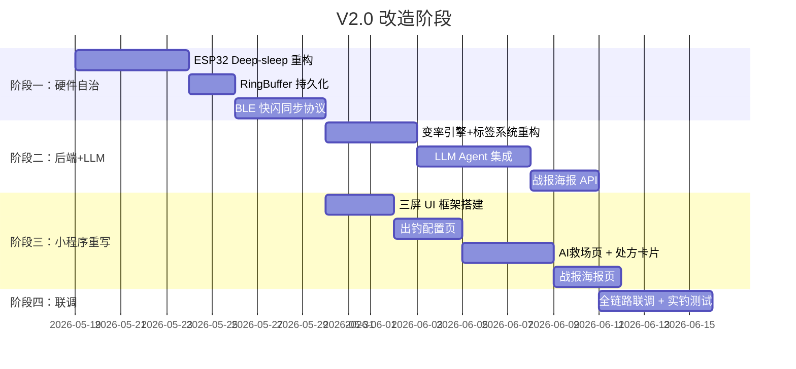

# V2.0 全栈改造执行计划

> **项目**: AI 钓鱼智能系统 (diaoyu)
> **目标**: 从 V1.x "实时监控仪表盘" 升级为 V2.0 "三次握手战术专家系统"
> **日期**: 2026-05-18

---

## 一、现状 vs 目标：核心差异对照

| 维度 | V1.x 现状 | V2.0 目标 |
|------|----------|----------|
| **ESP32 工作模式** | 常驻唤醒，60s 采集循环，BLE 持续连接 | Deep-sleep + RTC 唤醒（10-15min），BLE 断连自治 |
| **BLE 协议** | Notify 监听器模式（实时逐条推送） | REQ-ACK 批量快闪同步（1秒全量 Dump） |
| **后端算法** | 本地多因子评分 → 直接返回 JSON | 本地变率/阈值硬算 → 打标签 → 喂给 LLM 生成处方 |
| **LLM 集成** | 无 | 云端轻量化大模型（System Prompt 限定角色） |
| **小程序 UI** | 5个 Tab（决策/监测/趋势/日志/隐私），密集仪表盘 | 3 屏极简流（出钓配置 → AI救场 → 战报海报） |
| **用户动线** | 需长时间挂手机看实时数据 | 三次握手：开局配置 → 卡壳求助 → 收竿炫耀 |

---

## 二、分阶段执行路线



---

## 三、阶段一：ESP32 硬件自治改造

### 任务 1.1：Deep-sleep + RTC 唤醒重构

**改动文件**:
- [esp32/main.py](file:///d:/cursor_code/diaoy/esp32/main.py) — **重写主循环**
- [esp32/config.py](file:///d:/cursor_code/diaoy/esp32/config.py) — 新增 Deep-sleep 参数

**现状**: `main.py` 使用 `while True` + `keepalive_sleep(60s)` 常驻循环，CPU 永不休眠。

**改造要点**:
1. 将主循环改为 **单次采集 → 写缓冲 → 进 Deep-sleep** 模式
2. 使用 `machine.deepsleep(WAKEUP_INTERVAL_MS)` 替代 `keepalive_sleep`
3. 唤醒间隔 `WAKEUP_INTERVAL_MS = 10 * 60 * 1000`（10 分钟）
4. 开机时通过 `machine.reset_cause()` 判断冷启动 vs RTC 唤醒，决定是否初始化 BLE
5. **仅在检测到 BLE 连接请求时才启动广播**，否则采集完直接睡

**关键代码结构变化**:
```python
# esp32/main.py — V2.0 核心逻辑
import machine

def main():
    cause = machine.reset_cause()
    ring_buffer = RingBuffer(persistent=True)  # 持久化模式
    
    if cause == machine.DEEPSLEEP_RESET:
        # RTC 唤醒 → 静默采集 → 存盘 → 继续睡
        sample_and_store(ring_buffer)
        machine.deepsleep(WAKEUP_INTERVAL_MS)
    else:
        # 冷启动 → 初始化 BLE → 等待连接 → 对表 → 批量同步
        ble_service = BLEService(ring_buffer)
        ble_service.init()
        run_connected_mode(ble_service, ring_buffer)
```

**验收标准**: ESP32 断开手机后自动进入 Deep-sleep，电流 < 10μA；唤醒后采集 + 写入 < 2 秒。

---

### 任务 1.2：RingBuffer 持久化（Flash 存储）

**改动文件**:
- [esp32/storage/ring_buffer.py](file:///d:/cursor_code/diaoy/esp32/storage/ring_buffer.py) — **增加 Flash 持久化**

**现状**: `RingBuffer` 纯内存 `list`，Deep-sleep 后数据全丢。

**改造要点**:
1. 使用 MicroPython 的文件系统将缓冲区序列化到 Flash（`/data/ring.bin`）
2. 每次 `write()` 后增量追加到文件，避免全量写（Flash 寿命保护）
3. 唤醒时 `__init__` 从文件恢复游标和数据
4. 保留内存模式作为 fallback（构造函数 `persistent=False` 参数）

**数据格式**: 每条记录固定 16 字节 `struct.pack('<Ifff', ts, tw, ta, pl)`，文件头 12 字节存元数据（write_cursor, sync_cursor, total_written）。

**验收标准**: Deep-sleep 10 次后数据完整不丢，`get_unsent()` 返回正确条数。

---

### 任务 1.3：BLE 协议从 "Notify 监听" 升级为 "REQ-ACK 批量快闪"

**改动文件**:
- [esp32/ble/protocol.py](file:///d:/cursor_code/diaoy/esp32/ble/protocol.py) — 新增 `CMD_BULK_DUMP` 指令
- [esp32/ble/service.py](file:///d:/cursor_code/diaoy/esp32/ble/service.py) — 重构连接后行为
- [esp32/config.py](file:///d:/cursor_code/diaoy/esp32/config.py) — 新增指令码
- [miniprogram/utils/protocol.js](file:///d:/cursor_code/diaoy/miniprogram/utils/protocol.js) — 对应解码
- [miniprogram/utils/ble.js](file:///d:/cursor_code/diaoy/miniprogram/utils/ble.js) — 重构连接后流程

**现状**: ESP32 持续 Notify 实时帧，小程序被动监听 `onBLECharacteristicValueChange`。

**改造要点**:
1. 新增 `CMD_BULK_DUMP = 0x08`：小程序连接后发此指令，ESP32 将 RingBuffer 全部未发数据分批快闪回传
2. 每批仍用 `CMD_HISTORY_DATA (0x03)` 帧格式，但连发不等 ACK（快闪模式）
3. 全部发完后发 `CMD_DUMP_COMPLETE = 0x09` 标记结束
4. 小程序收到 `CMD_DUMP_COMPLETE` 后一次性 ACK 全部，ESP32 `mark_all_sent()`
5. **V1 的实时 Notify 逻辑保留为可选模式**，通过 `CMD_ENTER_REALTIME = 0x0A` 切换

**验收标准**: 2 小时离线（120 条数据）重连后 1 秒内全量同步到小程序。

---

## 四、阶段二：后端 + LLM 改造

### 任务 2.1：变率引擎 + 特征标签系统重构

**改动文件**:
- [domain/analyzers.py](file:///d:/cursor_code/diaoy/domain/analyzers.py) — 增强变率计算
- [domain/tags.py](file:///d:/cursor_code/diaoy/domain/tags.py) — 新增主观症状标签
- [domain/services.py](file:///d:/cursor_code/diaoy/domain/services.py) — 拆分为硬算层 + 标签输出层
- 新增 `domain/symptom_tags.py` — 主观症状标签定义

**现状**: `services.py` (1122行) 既做硬算又做文案生成，标签仅用于内部评分。

**改造要点**:
1. **拆分 `services.py`**: 将现有 1122 行拆为：
   - `domain/engine.py`（~500行）— 纯物理变率计算 + 阈值过滤 + 硬规则标签
   - `domain/prescription.py`（~200行）— 调用 LLM 生成处方（新文件）
   - `domain/services.py`（~300行）— 编排层，串联 engine → prescription
2. **新增主观症状标签**（用户在小程序勾选后上传）：
   ```python
   # domain/symptom_tags.py
   class SymptomTag(str, Enum):
       SYM_BUBBLES_NO_BITE = "有地星跑泡但不咬钩"
       SYM_SMALL_FISH_INTERCEPT = "杂鱼截口严重"
       SYM_NO_ACTIVITY = "完全无口无鱼星"
       SYM_FLOAT_DRIFT = "浮漂频繁走水"
       SYM_FISH_JUMP = "看到鱼跳但不吃饵"
       # ... 更多
   ```
3. `engine.py` 输出结构化 JSON：
   ```json
   {
     "physical_tags": ["STATUS_PRESSURE_DROP", "STATUS_THERMOCLINE_STRONG"],
     "symptom_tags": ["SYM_BUBBLES_NO_BITE"],
     "metrics": {"delta_p_2h": -2.1, "thermocline_index": 4.2, "do_est": 6.8},
     "fish_context": {"target": "土鲮", "method": "底钓", "bait": "香腥"}
   }
   ```

**验收标准**: `engine.py` 纯函数，无任何 LLM 调用，输出 JSON 可被单元测试覆盖。

---

### 任务 2.2：LLM Agent 集成（战术处方生成）

**新增文件**:
- `domain/prescription.py` — LLM 处方生成器
- `domain/prompts.py` — System Prompt 模板管理
- `requirements.txt` — 增加 `openai` 或 `dashscope` SDK

**改造要点**:
1. **System Prompt 设计**（存放在 `domain/prompts.py`）：
   ```
   你是一位拥有30年华南水域实战经验的硬核钓鱼老师傅。
   你的任务是根据后端算好的物理状态和用户描述的水面症状，
   生成一张"战术处方卡片"。你只负责翻译和建议，绝不做数学计算。
   
   输出必须严格按以下 JSON 格式：
   {
     "diagnosis": "停口原因（1句话，引用具体数值）",
     "prescriptions": [
       {"action": "具体操作指令", "reason": "物理原理解释"},
       {"action": "...", "reason": "..."}
     ],
     "confidence_note": "补充说明"
   }
   ```
2. **调用链**: 小程序上报 `{sensors_dump, symptom_tags, fish_context}` → FastAPI → `engine.py` 算变率打标签 → `prescription.py` 拼接 prompt + 调用 LLM → 返回处方 JSON
3. **Token 成本控制**: 
   - System Prompt 固定 ~500 tokens
   - User Prompt（物理标签+症状）~200 tokens
   - 输出限制 `max_tokens=500`
   - 单次请求总成本 < ¥0.01

**验收标准**: 输入模拟标签组合，LLM 返回格式合规的处方 JSON，延迟 < 3 秒。

---

### 任务 2.3：新增 API 端点

**改动文件**:
- [server.py](file:///d:/cursor_code/diaoy/server.py) — 新增/重构端点

**新增端点**:

| 端点 | 方法 | 描述 | 对应握手 |
|------|------|------|----------|
| `POST /api/v2/session/start` | POST | 开始作钓（记录目标鱼/钓法/饵料） | 第一次握手 |
| `POST /api/v2/rescue` | POST | AI 鱼情救场（接收批量 dump + 症状标签） | 第二次握手 |
| `POST /api/v2/session/end` | POST | 结束作钓（接收渔获等级，生成战报） | 第三次握手 |
| `GET /api/v2/poster/{session_id}` | GET | 获取战报海报图片 | 第三次握手 |

**保留端点**（向后兼容）:
- `/api/predict` — V1 预测接口不删，加 `deprecated` 标记
- `/api/predict/weather` — 出发前天气预测保留
- `/api/fish-types` — 鱼种列表保留
- `/health` — 健康检查保留

---

### 任务 2.4：战报海报生成

**新增文件**:
- `domain/poster.py` — 海报 Canvas 数据生成（返回 JSON 描述，小程序端 Canvas 绘制）

**改造要点**:
1. 后端生成海报所需的结构化数据（水文曲线数据点、战绩文案、排名百分位）
2. 小程序端使用 `wx.createCanvasContext` 绘制长图
3. 文案模板举例：
   ```
   "{nickname}今日正面迎战{delta_p}hPa气压暴跌，
   通过AI起浮预警一键切半水，极限拉起{catch_desc}，
   击败全网{percentile}%钓友！"
   ```

---

## 五、阶段三：小程序 UI 重写

### 任务 3.1：页面架构重构

**现状页面**: decision / index / history / logs / privacy（5 个 Tab）
**V2.0 页面**: 3 屏流式体验 + 设置页

**改动文件**:
- [miniprogram/app.json](file:///d:/cursor_code/diaoy/miniprogram/app.json) — 重新配置页面和 TabBar

**新页面结构**:
```json
{
  "pages": [
    "pages/setup/setup",       // 出钓配置（第一次握手）
    "pages/rescue/rescue",     // AI鱼情救场（第二次握手）  
    "pages/report/report",     // 战报海报（第三次握手）
    "pages/settings/settings"  // 设置/历史
  ],
  "tabBar": {
    "list": [
      { "pagePath": "pages/setup/setup", "text": "开始作钓" },
      { "pagePath": "pages/rescue/rescue", "text": "AI救场" },
      { "pagePath": "pages/report/report", "text": "战报" }
    ]
  }
}
```

> [!IMPORTANT]
> V1 的 `pages/decision`、`pages/index`、`pages/history`、`pages/logs` **不删除**，仅从 `app.json` 的 pages 和 tabBar 中移除，保留代码作为参考。

---

### 任务 3.2：出钓配置页（第一次握手）

**新增文件**: `miniprogram/pages/setup/setup.{js,wxml,wxss,json}`

**UI 设计**:
- 大标签选择器：目标鱼种（卡片网格，如 土鲮/鲫鱼/罗非/鲤鱼）
- 大标签选择器：钓法（底钓/浮钓/路亚）
- 大标签选择器：饵料（香腥/本味/活饵）
- 底部大按钮：**"开始作钓"**（触发 BLE 连接 → 对表 → 下发配置 → 关屏）

**业务逻辑**:
1. 点击"开始作钓"→ 调用 `BLEManager.connectDevice()`
2. 连接成功后调用 `POST /api/v2/session/start` 创建会话
3. 存储 `session_id` 到全局
4. 提示用户"设备已就绪，手机可以放回口袋了"

---

### 任务 3.3：AI 救场页（第二次握手 — 产品灵魂）

**新增文件**: `miniprogram/pages/rescue/rescue.{js,wxml,wxss,json}`

**UI 设计**:
- 进入页面时自动触发 BLE 重连 + 批量 Dump
- Dump 完成后显示症状勾选面板（大号复选框标签）：
  - `[√] 有地星跑泡但不咬钩`
  - `[√] 杂鱼截口疯狂`
  - `[√] 完全没口`
  - `[√] 浮漂走水严重`
  - `[√] 看到鱼跳不吃饵`
- 点击 **"AI 开方"** 按钮 → loading → 显示**处方卡片**

**处方卡片 UI**:
```
╔══════════════════════════════╗
║  🏥 AI 战术处方              ║
╠══════════════════════════════╣
║  诊断：                      ║
║  过去2小时气压下跌2.1hPa，    ║
║  表底温差4.2℃形成温跃层...   ║
╠──────────────────────────────╣
║  处方①：推漂30cm钓离底       ║
║  原理：底层缺氧，鱼已上浮    ║
╠──────────────────────────────╣
║  处方②：饵料加轻粉拦截行程   ║
║  原理：鱼在中层觅食...       ║
╚══════════════════════════════╝
```

---

### 任务 3.4：战报海报页（第三次握手）

**新增文件**: `miniprogram/pages/report/report.{js,wxml,wxss,json}`

**UI 设计**:
- 渔获等级快速选择（4 个大图标卡片）：空军🛩️ / 惨淡😢 / 稳赚😊 / 爆护🔥
- 点击"生成战报"→ Canvas 绘制长图海报
- 一键分享到朋友圈/钓友群

---

## 六、改动文件清单汇总

### ESP32 固件层
| 文件 | 操作 | 核心变更 |
|------|------|----------|
| `esp32/main.py` | **重写** | while 循环 → Deep-sleep 单次采集 |
| `esp32/config.py` | **修改** | 新增 Deep-sleep、快闪协议参数 |
| `esp32/storage/ring_buffer.py` | **重写** | 内存 → Flash 持久化 |
| `esp32/ble/service.py` | **重构** | 新增批量 Dump 模式 |
| `esp32/ble/protocol.py` | **修改** | 新增 3 个指令码 |
| `esp32/utils/keepalive.py` | **删除** | Deep-sleep 模式下不再需要 |

### 后端领域层
| 文件 | 操作 | 核心变更 |
|------|------|----------|
| `domain/services.py` | **拆分重构** | 1122行 → engine.py + prescription.py + services.py |
| `domain/engine.py` | **新增** | 纯物理变率计算 + 硬规则标签输出 |
| `domain/prescription.py` | **新增** | LLM 处方生成器 |
| `domain/prompts.py` | **新增** | System Prompt 模板 |
| `domain/symptom_tags.py` | **新增** | 主观症状标签枚举 |
| `domain/poster.py` | **新增** | 战报海报数据生成 |
| `domain/tags.py` | **修改** | 新增主观症状相关标签 |
| `domain/analyzers.py` | **修改** | 增强变率计算方法 |
| `server.py` | **修改** | 新增 V2 API 端点 |
| `infrastructure/models.py` | **修改** | 新增 V2 Session 字段 |
| `requirements.txt` | **修改** | 新增 LLM SDK 依赖 |

### 小程序前端
| 文件 | 操作 | 核心变更 |
|------|------|----------|
| `miniprogram/app.json` | **修改** | 页面路由 + TabBar 重构 |
| `miniprogram/app.js` | **修改** | 全局状态适配 V2 会话模型 |
| `miniprogram/pages/setup/*` | **新增** | 出钓配置页（第一次握手） |
| `miniprogram/pages/rescue/*` | **新增** | AI 救场页（第二次握手） |
| `miniprogram/pages/report/*` | **新增** | 战报海报页（第三次握手） |
| `miniprogram/utils/ble.js` | **重构** | 适配批量 Dump 快闪协议 |
| `miniprogram/utils/protocol.js` | **修改** | 新增指令编解码 |
| `miniprogram/utils/api.js` | **修改** | 新增 V2 API 调用方法 |

---

## 七、风险与注意事项

> [!WARNING]
> **Deep-sleep 数据丢失风险**: Flash 写入必须在 `deepsleep()` 之前完成，需加校验。MicroPython 的文件系统在意外断电时可能损坏，建议使用双缓冲写入。

> [!WARNING]
> **LLM 幻觉风险**: System Prompt 必须严格限定角色和输出格式，禁止 LLM 做任何数学计算。所有数值由 `engine.py` 预算好，LLM 只做"翻译"。

> [!CAUTION]
> **微信小程序 AppSecret 泄露**: 当前 `server.py` 第 502-503 行硬编码了 `WX_APPID` 和 `WX_APP_SECRET`，V2.0 改造时务必迁移到环境变量。

> [!TIP]
> **向后兼容**: V1 的所有 API 端点和页面代码保留不删，V2 端点使用 `/api/v2/` 前缀隔离，便于灰度发布。

---

## 八、建议执行顺序

1. **先做阶段一（ESP32）** — 硬件改造是基础，其他都依赖批量 Dump 能力
2. **阶段二和阶段三可并行** — 后端 API 和小程序 UI 可由不同人并行开发
3. **LLM 集成（2.2）可最后做** — 先用模板文案兜底，LLM 作为增强
4. **战报海报（2.4 + 3.4）优先级最低** — 核心价值在阶段二的"AI 救场"

---

**请确认此计划是否符合预期，我可以立即开始任一阶段的编码实施。**
