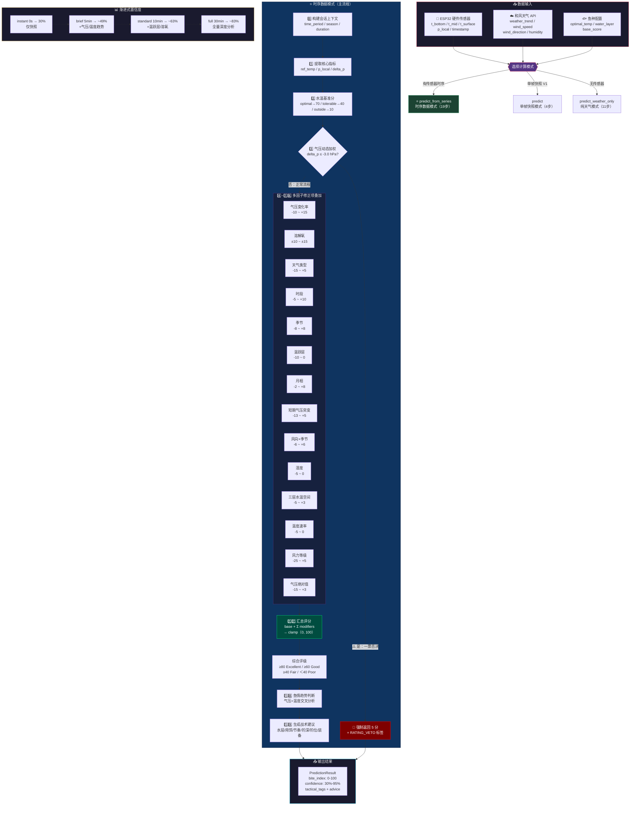

# 开口指数 (bite_index) 计算逻辑分析报告

## 一、概览

开口指数是本系统的**核心输出指标**，取值范围 `0–100`，代表当前环境下鱼类开口进食的概率/意愿。后台在 [FishingPredictionService](file:///d:/cursor_code/diaoy/domain/services.py#L30-L36) 中提供了 **三种计算模式**：

| 模式 | 入口方法 | 适用场景 | 置信度 |
|------|---------|---------|--------|
| 单帧快照 | `predict()` | 向后兼容，V1 协议 | 无（未给出） |
| 时序数据 ⭐ | `predict_from_series()` | 新版主接口，ESP32 传感器 + 云端天气 | 30%–95%（渐进式） |
| 纯天气 | `predict_weather_only()` | 无传感器，出发前粗略判断 | 固定 30% |

---

## 二、核心计算逻辑流程

### 整体流程图



### 模式一：`predict()` 单帧快照（4 步）

> 源码：[services.py L72-L114](file:///d:/cursor_code/diaoy/domain/services.py#L72-L114)

```
final_score = base_score + pressure_modifier + do_modifier + weather_modifier
            → clamp(0, 100)
```

| 步骤 | 调用方法 | 使用参数 | 输出 |
|------|---------|---------|------|
| 1. 溶氧估算 | `_calculate_do()` | `t_water`, `p_local`, `wind_speed` | `do_est` (mg/L) |
| 2. 水温基准分 | `_calc_temp_base_score()` | `t_water`, 鱼种 `optimal_temp`/`tolerable_temp` | 10 / 40 / 70 |
| 3. 气压加权 | `_calc_pressure_modifier()` | `delta_p`（2h 气压变化） | -10 ~ +15，或一票否决→强制5分 |
| 4. 天气加权 | `_calc_weather_modifier()` | `weather_trend` | -15 ~ +5 |

---

### 模式二：`predict_from_series()` 时序数据（19 步）⭐ 主接口

> 源码：[services.py L202-L418](file:///d:/cursor_code/diaoy/domain/services.py#L202-L418)

这是最完整的计算流程，**共融合 16 个修正项**，以加法方式叠加到基准分之上：

```
final_score = base_score
    + pressure_modifier         # 气压动态（2h变化率）
    + do_modifier               # 溶解氧
    + weather_modifier          # 天气类型
    + period_modifier           # 时段
    + season_modifier           # 季节
    + thermocline_modifier      # 温跃层
    + solunar_modifier          # 月相
    + short_pressure_modifier   # 短期气压突变（15min）
    + wind_dir_modifier         # 风向×季节
    + humidity_modifier         # 湿度
    + thermal_profile_modifier  # 三层水温空间
    + temp_rate_modifier        # 温度变化速率
    + wind_speed_modifier       # 风力等级
    + pressure_abs_modifier     # 气压绝对值
→ clamp(0, 100)
```

#### 完整 19 步流水线

| 步骤 | 方法 | 参数来源 | 输出/范围 | 启用条件 |
|------|------|---------|----------|---------|
| 0 | 构建会话上下文 | `readings[]` | `SessionContext` (time_period, season, duration, report_stage) | 始终 |
| 1 | 提取核心指标 | `series.latest`, `fish_profile.water_layer` | `ref_temp`, `p_local`, `delta_p` | 始终 |
| 2 | `_calc_temp_base_score` | `ref_temp`, 鱼种温度区间 | 10 / 40 / 70（视鱼种） | 始终 |
| 3 | `_calc_pressure_modifier` | `delta_p`（2h 气压变化率） | -10 ~ +15，或**一票否决** → 5分 | 始终 |
| 4 | `_calculate_do_from_values` + `_calc_do_modifier` | `p_local`, `ref_temp`, `wind_speed` | ±10 ~ ±15 | `do_estimate` in features |
| 5 | `_calc_weather_modifier` | `weather_trend` | -15 ~ +5 | 始终 |
| 6 | `_calc_time_period_modifier` | `time_period` (morning/noon/afternoon/evening) | -5 ~ +10 | 始终 |
| 7 | `_calc_season_modifier` | `season` (spring/summer/autumn/winter) | -8 ~ +8 | 始终 |
| 8 | `_calc_thermocline_modifier` | `t_bottom`, `t_mid`, `t_surface` | -10 ~ 0 | `thermocline` in features 且三层传感器 |
| 9 | 温度趋势分析 | `readings[]`, `fish_profile.water_layer` | 标签（rising/dropping/stable） | `temp_trend` in features |
| 9b | `_calc_temp_rate_modifier` | `readings[]` 温度速率 (℃/h) | 0 或 -5 | `temp_trend` in features |
| 10 | `_calc_solunar_modifier` | `timestamp` | -2 ~ +8 | 始终 |
| 11 | `_calc_short_pressure_modifier` | `readings[]` 15min 气压变化 | -13 ~ +5 | 始终（≥2 条读数） |
| 12 | `_calc_wind_direction_modifier` | `wind_direction`, `season` | -6 ~ +6 | 有风向数据 |
| 13 | `_calc_humidity_modifier` | `humidity` | -5 ~ 0 | 有湿度数据 |
| 14 | `_calc_thermal_profile_modifier` | `readings[]` 三层水温空间分析 | -5 ~ +3 | `thermocline` in features 且三层传感器 |
| 15 | `_calc_wind_speed_modifier` | `wind_speed` (m/s) | -25 ~ +5 | 始终 |
| 16 | `_calc_pressure_absolute_modifier` | `p_local` 绝对值 | -15 ~ +3 | 有本地气压 |
| 17 | 汇总评分 → `clamp(0, 100)` | — | **最终 bite_index** | — |
| 18 | 鱼情趋势判断 | 气压+温度趋势交叉 | 标签（improving/deteriorating） | `deep_analysis` in features |
| 19 | 生成战术建议 | 所有 tags + 用户数字钓箱 | 结构化 advice dict | 始终 |

---

### 模式三：`predict_weather_only()` 纯天气模式（11 步）

> 源码：[services.py L1328-L1437](file:///d:/cursor_code/diaoy/domain/services.py#L1328-L1437)

```
final_score = base_score + weather + period + season + solunar
    + wind_dir + humidity + wind_speed + do + weather_transition
→ clamp(0, 100)
```

| 步骤 | 参数 | 说明 |
|------|------|------|
| 推算水温 | `air_temp`, `season` | 用 `AirToWaterConfig` 偏移估算 |
| 水温基准分 | 推算水温 | 同上 |
| 天气加权 | `weather_trend` | 同上 |
| 时段加权 | 当前时间 | 同上 |
| 季节修正 | 当前月份 | 同上 |
| 月相评分 | 当前时间 | 同上 |
| 风向评分 | `wind_direction`, `season` | 同上 |
| 湿度评分 | `humidity` | 同上 |
| 风力等级 | `wind_speed` | 同上 |
| 溶氧估算 | 标准气压 1013.25 + 推算水温 | 兜底标准值 |
| 天气转变 | `hourly_forecast[]` | 雨后效应检测 (+5 ~ +12) |

---

## 三、参数清单汇总

### 3.1 硬件传感器参数（来自 ESP32）

| 参数 | 说明 | 使用位置 |
|------|------|---------|
| `t_bottom` | 底层水温 (℃) | 基准分、温跃层、趋势分析 |
| `t_mid` | 中层水温 (℃) | 温跃层分析、鱼种水层选温 |
| `t_surface` | 表层水温 (℃) | 温跃层分析、鱼种水层选温 |
| `p_local` | 本地气压 (hPa) | 气压变化率、溶氧估算、气压绝对值评分 |
| `timestamp` | 采集时间戳 | 时段/季节判定、月相计算、趋势分析 |

### 3.2 云端气象参数（来自和风天气 API）

| 参数 | 说明 | 使用位置 |
|------|------|---------|
| `weather_trend` | 天气类型枚举 (sunny/cloudy/overcast/rainy/stormy) | 天气加权 |
| `wind_speed` | 风速 (m/s) | 风力等级评分、溶氧风力增氧 |
| `wind_direction` | 风向 (N/NE/E/SE/S/SW/W/NW) | 风向×季节交叉评分 |
| `humidity` | 湿度 (%) | 湿度闷热检测 |
| `air_temp` | 气温 (℃) | 纯天气模式水温推算 |

### 3.3 鱼种配置参数（来自 `FishSpeciesProfile`）

| 参数 | 默认值（鲫鱼） | 说明 |
|------|--------------|------|
| `optimal_temp` | (15.0, 25.0) | 最适温度区间 |
| `tolerable_temp` | (5.0, 32.0) | 可忍受温度区间 |
| `base_score_optimal` | 70 | 最适区间基准分 |
| `base_score_tolerable` | 40 | 可忍受区间基准分 |
| `base_score_outside` | 10 | 超出可忍受区间基准分 |
| `water_layer` | "bottom" | 栖息水层，决定参考哪层水温 |

### 3.4 评分阈值与权重参数（来自 `BiteIndexConfig` 等）

> 完整定义见 [constants.py](file:///d:/cursor_code/diaoy/domain/constants.py#L194-L609)

| 配置类 | 关键参数 | 值 |
|--------|---------|-----|
| `BiteIndexConfig` | `pressure_crash_threshold` | -3.0 hPa/2h（一票否决） |
| | `pressure_crash_score` | 5（否决后强制分） |
| | `pressure_rise_bonus` | +15 上限 |
| | `pressure_drop_penalty` | -10 上限 |
| | `do_danger_line` | 4.0 mg/L |
| | `do_bonus` / `do_penalty` | +10 / -15 |
| `TimePeriodConfig` | morning/noon/afternoon/evening | +8 / -5 / +3 / +10 |
| `SeasonConfig` | spring/summer/autumn/winter | +5 / -3 / +8 / -8 |
| `SolunarConfig` | 新月/满月 / 上弦/下弦 | +8 / -2 |
| `PressureAnalysisConfig` | `short_drop_threshold` | -1.5 hPa/15min |
| `WindDirectionConfig` | 8 方位 × 季节交叉 | -6 ~ +6 |
| `HumidityConfig` | `muggy_threshold` | 85% |
| `WindSpeedConfig` | 6 档分级 | -25 ~ +5 |
| `PressureAbsoluteConfig` | 极低/低/适宜/高 | -15 ~ +3 |
| `ThermoclineConfig` | 强温跃层 / 逆温 | -8 / -10 |

---

## 四、合理性评价

### ✅ 做得好的部分

1. **多因子融合维度丰富**：融合了 16 个修正项，涵盖水温、气压（动态+绝对值+短期）、溶氧、天气、时段、季节、月相、风向、湿度、风力、温跃层、三层水温空间、温度速率等，**维度覆盖非常全面**。

2. **一票否决机制合理**：气压 2h 跌幅 ≤ -3.0 hPa 时直接返回 5 分，符合"闷天不上鱼"的钓鱼常识，是关键的安全阀。

3. **渐进式置信度设计精巧**：数据量不足时不强行启用高级分析（如温跃层需≥10min，深度分析需≥30min），置信度随采集时长对数增长，**给用户合理的信心预期**。

4. **鱼种维度差异化**：不同鱼种有独立的温度区间、水层、基准分和饵料配置，**不是一套评分通吃**。

5. **季节×温度趋势交叉修正**：夏季降温视为利好、冬季升温视为黄金窗口，这种交叉逻辑**体现了专业钓鱼知识**。

6. **风向×季节交叉**：夏季北风降温反而好（+2），冬季南风回暖强正面（+6），**比简单的风向加减分更精确**。

### ⚠️ 值得关注的问题

#### 1. 纯加法体系的分数溢出/饱和风险

> [!WARNING]
> 所有修正项为简单加法叠加，理论极端值范围约为 **-96 ~ +138**（基准分 10~70 + 所有修正项极值）。虽然最终 `clamp(0, 100)` 保证了输出范围，但这导致：
> - 极端好天气叠加后很容易触顶 100 分，区分度丧失
> - 极端差天气叠加后很容易触底 0 分，区分度同样丧失
> - 中间段的分值对单一因子变化不够敏感

**建议**：考虑引入乘法因子（如 `base_score × Π(1 + modifier_i/100)`）或分段非线性映射，让极端场景仍有区分度。

#### 2. 气压修正在「时序模式」和「单帧模式」中的一致性

在 `predict_from_series()` 中，`delta_p` 是从时序数据自动计算的 2h 变化率（精确），但在 `predict()` 单帧模式中直接取硬件上报的 `delta_p` 字段。两者的数据精度不同，单帧模式的 `delta_p` 质量取决于硬件端的计算逻辑。

#### 3. 纯天气模式缺少气压绝对值评分

`predict_weather_only()` 使用固定标准气压 `1013.25 hPa`，**跳过了 `_calc_pressure_absolute_modifier`**。如果和风天气 API 能提供当地气压，可以补上此修正项，提升纯天气模式的准确性。

#### 4. 溶解氧估算的"虚拟"性

溶氧通过查表+气压修正+风力增氧估算，**没有考虑水体类型**（流水 vs 死水塘、水草覆盖率）。这是传感器无法提供的维度，但可以考虑让用户标注水体类型后做系数调整。

#### 5. ~~月相修正未使用大口期/小口期加分~~ ✅ 已修复

经评估，`major_period_bonus` 和 `minor_period_bonus` **没有实际意义**：
- Solunar Theory 中的“大口期”指月中天/月对冲时段，“小口期”指月出/月落时段
- 要计算这些时段需要**基于经纬度的月球赤纬/时角天文计算**，当前 `solunar.py` 完全不具备此能力
- 月相本身的 ±8 分修正已足够体现月球周期影响

→ **已删除** `SolunarConfig` 中的这两个参数及 `TacticalTag` 中对应的 `SOLUNAR_MAJOR_PERIOD` / `SOLUNAR_MINOR_PERIOD` 标签。

#### 6. ~~气压绝对值标签使用了硬编码字符串~~ ✅ 已修复

→ **已统一** `_calc_pressure_absolute_modifier` 和 `_generate_tactical_advice` 中的所有硬编码标签为 `TacticalTag` 枚举引用，并在 `TacticalTag` 中新增了 `PRESSURE_ABS_*` 和 `WEATHER_*` 系列枚举定义。

---

## 五、整体结论

**开口指数的计算逻辑总体上是合理且专业的**。它融合了钓鱼领域的多维度经验知识，通过渐进式置信度和鱼种差异化配置，在"有硬件数据"和"无硬件数据"两种场景下都能给出有意义的参考。

主要改进方向：
1. 评分体系从纯加法升级为加法+乘法混合，避免分数饱和
2. 补全月相大口期/小口期的实际计算
3. 统一标签风格（全部使用 `TacticalTag` 枚举）
4. 纯天气模式补充气压绝对值修正
