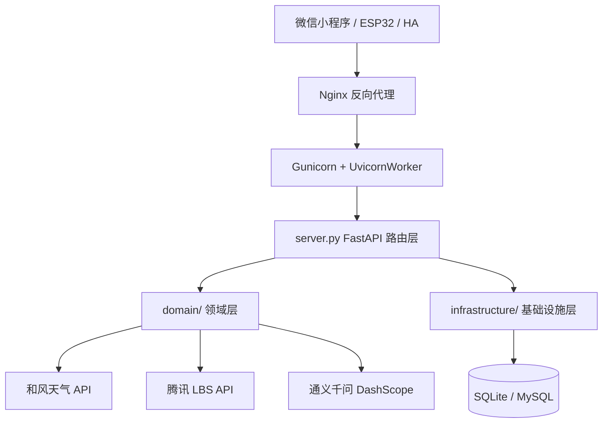
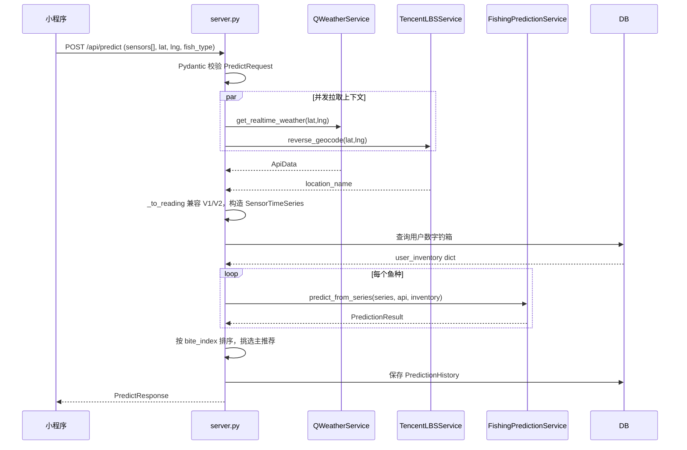
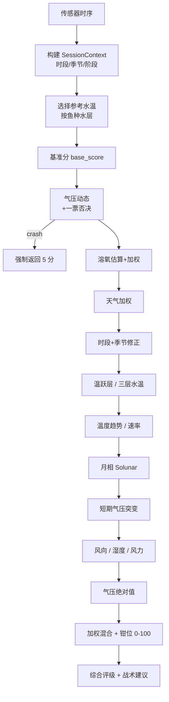
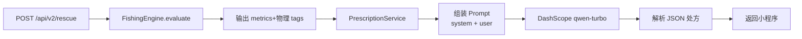
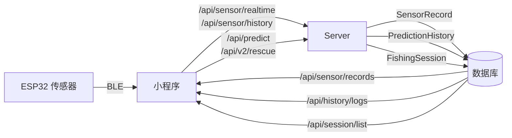

# 03 系统架构

## 3.1 分层架构

层间约束：

- **接入层 → 领域层**：调用 `FishingPredictionService` / `FishingForecastService` / `FishingEngine` / `PrescriptionService` / `QWeatherService` / `TencentLBSService` / `PosterGenerator`。
- **接入层 → 基础设施层**：通过 `Depends(get_db)` 获取 SQLAlchemy `Session`，操作 ORM 模型。
- **领域层 ↛ 基础设施层**：领域层不直接依赖 ORM，只接受 / 返回值对象（`SensorReading`、`SensorTimeSeries`、`ApiData`、`PredictionResult`）。
- **领域层 → 外部 API**：仅通过 `httpx.AsyncClient` 调用，所有调用集中在 [`weather.py`](file:///d:/diaoyu/diaoyu/domain/weather.py)、[`lbs.py`](file:///d:/diaoyu/diaoyu/domain/lbs.py)、[`prescription.py`](file:///d:/diaoyu/diaoyu/domain/prescription.py)。

## 3.2 主预测请求链路

以 `POST /api/predict` 为例：

源码定位：[`server.py` 行 903–1033](file:///d:/diaoyu/diaoyu/server.py)。

## 3.3 核心评分流水线

`predict_from_series` 内部按以下顺序累加修正项（[`services.py` 行 202-419](file:///d:/diaoyu/diaoyu/domain/services.py)）：

每一项是否启用受 `report_stage` 决定（见 [01-项目概述 §1.4](./01-项目概述.md#渐进式置信度)）。

## 3.4 V2 AI 救场流程

[`engine.py`](file:///d:/diaoyu/diaoyu/domain/engine.py) 把传感器变率转成结构化 `tags + metrics`，避免让 LLM 做数学计算；[`prescription.py`](file:///d:/diaoyu/diaoyu/domain/prescription.py) 仅负责调用 LLM 并解析 JSON。

## 3.5 数据流总览

