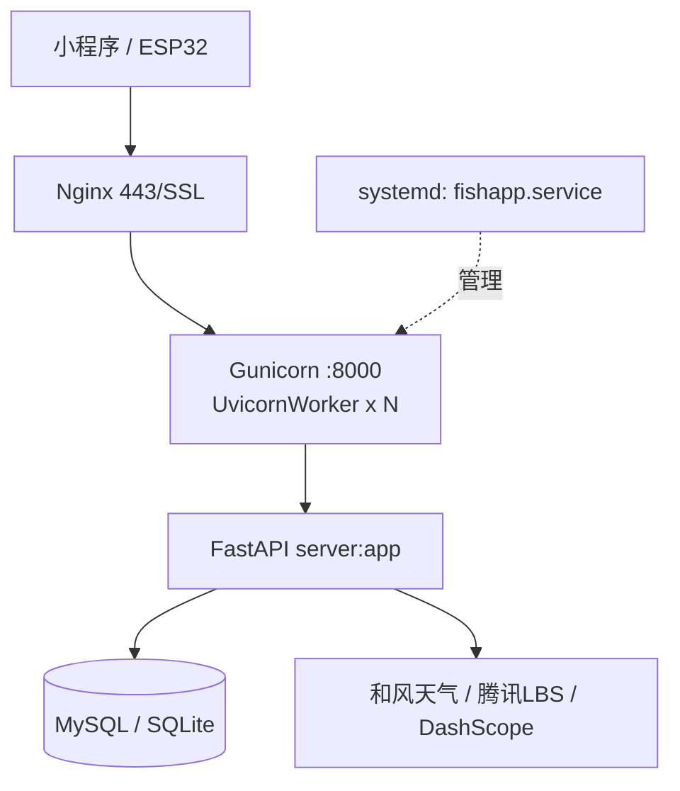

# 08 · 部署与运维

生产环境采用 **Gunicorn（UvicornWorker）+ systemd + Nginx** 的标准三层栈，目标域名 `https://ks.gzbaoge.com`，工作目录 `/mnt/diaoyu`。

---

## 1. 部署拓扑



- **Nginx**：终止 SSL，反向代理 `/api/`、`/health`、`/docs`、`/redoc`、`/openapi.json` 至 `127.0.0.1:8000`。
- **Gunicorn**：多 worker 进程，由 systemd 拉起，崩溃自动重启。
- **UvicornWorker**：Gunicorn 调度的 ASGI worker，运行 FastAPI 应用。
- **systemd**：进程守护、开机自启、资源限制、安全沙箱。

---

## 2. Gunicorn 配置：[gunicorn.conf.py](file:///d:/diaoyu/diaoyu/gunicorn.conf.py)

| 配置项 | 值 | 说明 |
|---|---|---|
| `bind` | `127.0.0.1:8000` | 仅本地回环监听，对外由 Nginx 暴露 |
| `workers` | `min(CPU*2+1, 4)` | 小型 VPS 上限 4，避免内存爆 |
| `worker_class` | `uvicorn.workers.UvicornWorker` | ASGI 适配 FastAPI |
| `timeout` | `30s` | 单请求处理超时；LLM 接口需注意 |
| `graceful_timeout` | `10s` | 收到 SIGTERM 后的优雅关闭窗口 |
| `keepalive` | `5s` | HTTP keep-alive 连接保活时间 |
| `accesslog` | `logs/access.log` | 相对 `WorkingDirectory` |
| `errorlog` | `logs/error.log` | 相对 `WorkingDirectory` |
| `loglevel` | `info` | 排障时临时改 `debug` |
| `pidfile` | `gunicorn.pid` | systemd 通过 MAINPID 管理，不强依赖 |
| `daemon` | `False` | 由 systemd 托管，禁用守护模式 |
| `worker_connections` | `1000` | 单 worker 最大并发连接 |
| `max_requests` | `5000` | 处理 5000 请求后 worker 自动重启，**防内存泄漏** |
| `max_requests_jitter` | `500` | 加随机抖动，避免雪崩式重启 |

完整文件见 [gunicorn.conf.py](file:///d:/diaoyu/diaoyu/gunicorn.conf.py#L1-L36)。

---

## 3. systemd 单元：[deploy/fishapp.service](file:///d:/diaoyu/diaoyu/deploy/fishapp.service)

完整内容见 [fishapp.service](file:///d:/diaoyu/diaoyu/deploy/fishapp.service#L1-L27)。要点拆解：

```ini
[Unit]
Description=AI Fishing Prediction API Service (ks.gzbaoge.com)
After=network.target

[Service]
Type=simple
User=fishapp                        # 专用低权限账户
Group=fishapp
WorkingDirectory=/mnt/diaoyu
Environment="PATH=/usr/local/bin:/usr/bin:/bin"
ExecStart=/usr/local/bin/gunicorn server:app -c gunicorn.conf.py
ExecReload=/bin/kill -HUP $MAINPID  # 平滑 reload
Restart=always
RestartSec=5

# 安全加固
PrivateTmp=true                     # 独立 /tmp
NoNewPrivileges=true                # 禁止提权
ProtectSystem=strict                # 只读根文件系统
ReadWritePaths=/mnt/diaoyu/logs     # 仅日志目录可写

# 资源限制
LimitNOFILE=65535                   # 最大文件描述符

[Install]
WantedBy=multi-user.target
```

### 3.1 安装

```bash
# 1. 创建专用用户
sudo useradd -r -s /bin/false fishapp
sudo mkdir -p /mnt/diaoyu/logs
sudo chown -R fishapp:fishapp /mnt/diaoyu

# 2. 拷贝单元文件
sudo cp deploy/fishapp.service /etc/systemd/system/

# 3. 重载并启用
sudo systemctl daemon-reload
sudo systemctl enable --now fishapp

# 4. 检查状态
sudo systemctl status fishapp
```

### 3.2 常用运维命令

```bash
sudo systemctl start fishapp        # 启动
sudo systemctl stop fishapp         # 停止
sudo systemctl restart fishapp      # 重启
sudo systemctl reload fishapp       # 平滑 reload（不断连接）
sudo systemctl status fishapp       # 状态
sudo journalctl -u fishapp -f       # 实时日志（systemd 维度）
tail -f /mnt/diaoyu/logs/access.log # 访问日志
tail -f /mnt/diaoyu/logs/error.log  # 错误日志
```

---

## 4. Nginx 反向代理：[deploy/nginx-fishapp.conf](file:///d:/diaoyu/diaoyu/deploy/nginx-fishapp.conf)

SSL 证书由用户自行在已有 server 块中配置，本文件只提供 `location` 规则。完整内容见 [nginx-fishapp.conf](file:///d:/diaoyu/diaoyu/deploy/nginx-fishapp.conf#L1-L64)。

### 4.1 关键 location

| 路径 | 代理目标 | 关键参数 |
|---|---|---|
| `/api/` | `http://127.0.0.1:8000` | `client_max_body_size 10M`（批量传感器上报） |
| `/health` | `http://127.0.0.1:8000/health` | `access_log off`（去噪） |
| `/docs` | `http://127.0.0.1:8000/docs` | Swagger UI（生产可注释） |
| `/redoc` | `http://127.0.0.1:8000/redoc` | ReDoc |
| `/openapi.json` | `http://127.0.0.1:8000/openapi.json` | OpenAPI Schema |

### 4.2 公共代理头

```nginx
proxy_set_header Host $host;
proxy_set_header X-Real-IP $remote_addr;
proxy_set_header X-Forwarded-For $proxy_add_x_forwarded_for;
proxy_set_header X-Forwarded-Proto $scheme;

proxy_connect_timeout 30s;
proxy_read_timeout    30s;
proxy_send_timeout    30s;
```

`proxy_*_timeout` 与 Gunicorn `timeout=30s` 对齐，避免 worker 已终止但 Nginx 仍等待。

### 4.3 部署步骤

```bash
# 1. 复制配置（合并到现有 SSL server 块）
sudo cp deploy/nginx-fishapp.conf /etc/nginx/conf.d/fishapp.conf

# 2. 编辑现有 server 块，将 location 段并入 443 ssl 段中
sudo nano /etc/nginx/conf.d/fishapp.conf

# 3. 测试配置
sudo nginx -t

# 4. 平滑重载
sudo nginx -s reload
```

---

## 5. 日志管理

| 日志 | 路径 | 来源 |
|---|---|---|
| Gunicorn 访问日志 | `/mnt/diaoyu/logs/access.log` | 由 `gunicorn.conf.py` 指定 |
| Gunicorn 错误日志 | `/mnt/diaoyu/logs/error.log` | 包含未捕获异常堆栈 |
| systemd 日志 | `journalctl -u fishapp` | 启动/重启/退出码 |
| Nginx 访问日志 | `/var/log/nginx/access.log`（默认） | 全量请求 |
| Nginx 错误日志 | `/var/log/nginx/error.log`（默认） | 5xx / 上游连接失败 |

建议配合 logrotate 进行轮转：

```bash
# /etc/logrotate.d/fishapp
/mnt/diaoyu/logs/*.log {
    daily
    rotate 14
    compress
    delaycompress
    missingok
    notifempty
    create 0640 fishapp fishapp
    sharedscripts
    postrotate
        systemctl reload fishapp >/dev/null 2>&1 || true
    endscript
}
```

---

## 6. 健康检查与监控

- **健康端点**：[GET /health](file:///d:/diaoyu/diaoyu/server.py#L126) 返回 `{"status": "ok"}`，Nginx 已关闭其 access_log。
- **接入云监控**：可让阿里云/腾讯云监控每 30s 探测 `https://ks.gzbaoge.com/health`，5xx 或超时告警。
- **进程监控**：`systemctl status fishapp` 或 Prometheus node_exporter + systemd_collector。

---

## 7. 升级发布流程

```bash
cd /mnt/diaoyu
sudo -u fishapp git pull                          # 拉取代码
sudo -u fishapp /usr/local/bin/pip install -r requirements.txt --upgrade  # 同步依赖
sudo -u fishapp python migrate_v2.py              # 如有数据库变更
sudo systemctl reload fishapp                     # 平滑 reload（不断连接）
# 或：sudo systemctl restart fishapp（强制重启）
sudo journalctl -u fishapp -n 50                  # 检查日志
curl -fsS https://ks.gzbaoge.com/health           # 冒烟
```

---

## 8. 常见运维问题

| 现象 | 排查路径 |
|---|---|
| 502 Bad Gateway | `systemctl status fishapp` → 查 Gunicorn 是否启动；`logs/error.log` 看堆栈 |
| 504 Gateway Timeout | LLM 调用超时；检查 `proxy_read_timeout` 与 Gunicorn `timeout` 是否对齐；可临时调大 |
| 内存持续上涨 | 验证 `max_requests=5000` 是否生效；用 `htop` 观察 worker RSS 是否被周期性回收 |
| 数据库锁（SQLite） | 生产请改用 MySQL：设置 `DATABASE_URL=mysql+pymysql://...` |
| `/docs` 返回 404 | 确认 Nginx `/docs` location 已合并；或确认未在生产关闭 |
| ESP32 上报 413 | `client_max_body_size 10M` 是否生效；批量条数过大时分批上报 |

---

[← 07 测试与开发](./07-测试与开发.md) | [→ 09 外部集成与配置](./09-外部集成与配置.md)
