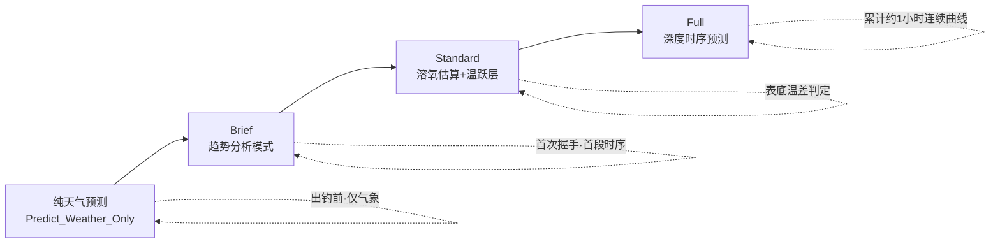
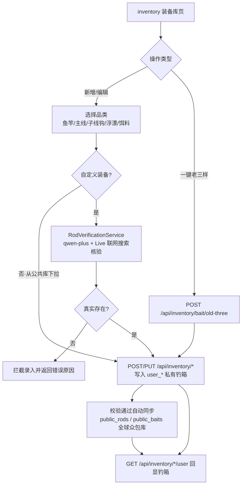
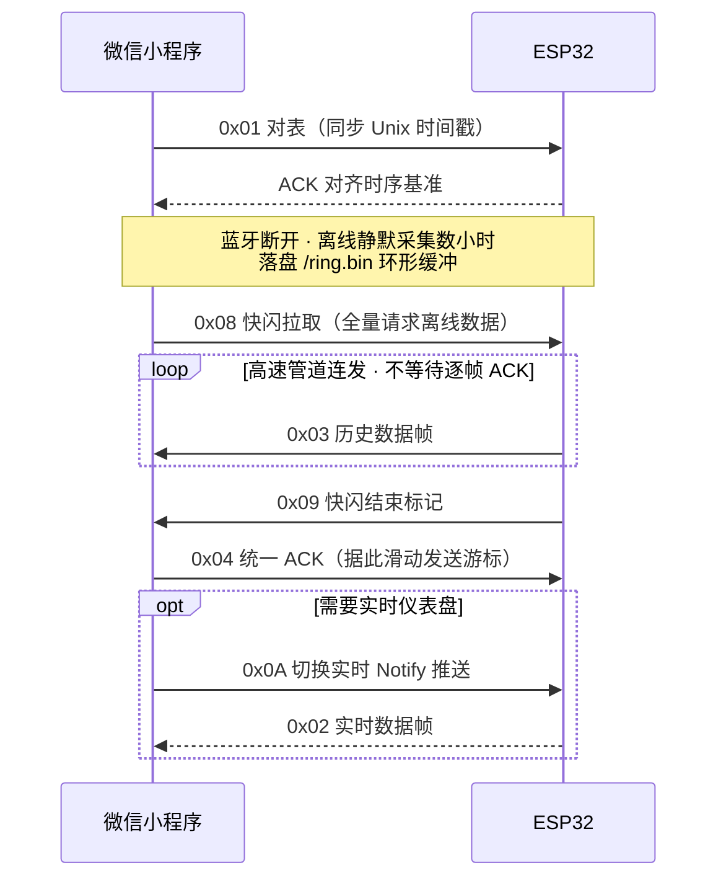

# AI 智能钓鱼助手 · 业务流程图

> 基于「三次精密握手」的软硬一体野钓决策业务流程。
> 角色：钓鱼人(U) · 微信小程序(MP) · ESP32 感知硬件(HW) · FastAPI 后台(Server) · 通义千问大模型(LLM)。

---

## 一、全流程主干流程图（含分支决策）

```mermaid
flowchart TD
    Start([钓鱼人开启出钓]) --> Login[/小程序登录 wx.login 取 code<br/>POST /api/login → 换取 openid/]
    Login -.openid 作为 X-OpenID 贯穿全程鉴权与落库.-> GPS

    %% ===== 阶段一：出钓筹备 =====
    subgraph P1[阶段一 · 出钓筹备期 — 纯天气前置预测]
        Login --> GPS[GPS定位 + 抓取时间戳<br/>腾讯LBS]
        GPS --> WX[拉取云端气象<br/>气压/ΔP/风/温/湿]
        WX --> PW[POST /api/predict/weather<br/>纯天气开口指数 0-100]
        PW --> FC[GET /api/forecast/today 24h逐小时<br/>GET /api/forecast/3day 三天日历]
        FC --> Card1[decision页渲染开口指数卡片<br/>+ 战术标签 + 最佳出钓窗口]
        Card1 --> Q1{今日适合出钓?}
    end
    Q1 -->|否· 闭口警告| Wait[改期 / 仅做装备准备]
    Wait --> End0([结束])
    Q1 -->|是| Go[前往钓点 + 装备采购建议]

    %% ===== 第一次握手 =====
    subgraph H1[第一次握手 · 出钓开局配置 Setup]
        Go --> Setup[setup页:选目标鱼/钓法/饵料]
        Setup --> NeedAdd{录入新竿/饵料?}
        NeedAdd -->|是| Verify[RodVerificationService<br/>qwen-plus + 联网搜索核验]
        Verify --> VOK{真实存在?}
        VOK -->|否| Reject[拦截录入并提示] --> Setup
        VOK -->|是| SaveBox[写入 user_rods 钓箱<br/>同步 public_rods 公共库]
        NeedAdd -->|否| Connect
        SaveBox --> Connect[BLE秒连ESP32]
        Connect --> Sync[下发对表指令 0x01<br/>同步Unix时间戳]
        Sync --> Ack1[HW回ACK]
    end

    %% ===== 阶段二：硬件自治采集 =====
    Ack1 --> Drop[硬件沉入水底<br/>蓝牙断开·手机入袋]
    subgraph P2[阶段二 · 硬件静默自治采集]
        Drop --> Sleep[RTC每10-15分钟唤醒]
        Sleep --> Collect[BMP280测气压<br/>多点DS18B20测三层水温]
        Collect --> Ring[写入Flash环形缓冲<br/>/ring.bin 防断电]
        Ring --> Deep[重新进入Deep-sleep<br/>keepalive脉冲保活]
        Deep --> More{继续作钓?}
        More -->|是| Sleep
    end

    %% ===== 第二次握手 =====
    More -->|遇鱼情突变| Trigger
    subgraph H2[第二次握手 · AI 鱼情救场 Rescue]
        Trigger[rescue页:勾选主观症状<br/>鱼星不咬/杂鱼截口/浮头] --> Reconn[BLE自动重连]
        Reconn --> Dump[发送快闪拉取 0x08]
        Dump --> Flash[HW 1秒全量Dump 0x03<br/>结束标记 0x09]
        Flash --> Ack2[MP统一回ACK 0x04]
        Ack2 --> Upload[POST /api/sensor/history<br/>+ POST /api/predict / api/v2/rescue]
        Upload --> Engine[domain/engine.py 时序求导<br/>判定ΔP跌幅 + 温跃层 + 溶氧]
        Engine --> Tags[打特征标签<br/>STATUS_PRESSURE_CRASH 等]
        Tags --> CallLLM[调用LLM:30年老钓手<br/>融合特征+主观症状+钓箱]
        CallLLM --> Rx[返回结构化战术处方卡片]
        Rx --> Show[小程序弹出神医改钓卡片]
    end
    Show --> Adjust[钓鱼人按处方纠偏<br/>推漂/换饵/改钓层]
    Adjust --> Again{需再次纠偏?}
    Again -->|是| Trigger

    %% ===== 第三次握手 =====
    Again -->|否·收竿| Finish
    subgraph H3[第三次握手 · 收竿战报海报 Report]
        Finish[report页:点击结束作钓<br/>选战绩 空军/惨淡/稳赚/爆护] --> Hibernate[下发指令:HW无限期深睡<br/>断开蓝牙]
        Hibernate --> SaveSession[POST /api/session/save<br/>聚合全天时序会话]
        SaveSession --> Poster[GET /api/v2/poster/:id<br/>合成战报长图数据]
        Poster --> Photo[上传渔获照片]
        Photo --> Share[一键分享微信群/朋友圈]
    end
    Share --> End([完成本次作钓周期])
```

---

## 二、计算模式递进泳道（数据驱动的模式升级）

---

## 三、数字钓箱装备管理（跨阶段独立子流程）

> 装备库通过 `inventory` 标签页 + `add-*` 页面**独立维护**，不依赖某次出钓；
> 既可在出钓前筹备，也可在开局/救场时临时补录。其产出 `user_inventory` 会作为上下文注入预测与 LLM 处方。

---

## 四、关键节点说明

| 阶段 | 触发动作 | 核心接口 | 输出 |
|---|---|---|---|
| 出钓筹备 | 开屏定位 | `POST /api/predict/weather` | 纯天气开口指数卡片 + 标签 |
| 第一次握手 (Setup) | 选鱼/钓法/对表 | `inventory/*`、BLE `0x01` | 装备/线组开局建议，硬件对时 |
| 自治采集 | 硬件入水 | — (HW本地 RingBuffer) | 三层水温/气压时序落盘 |
| 第二次握手 (Rescue) | 勾选主观症状 | BLE `0x08`→`0x03`/`0x09`、`POST /api/v2/rescue` | LLM 战术处方卡片 |
| 第三次握手 (Report) | 结束作钓 | `POST /api/session/save`、`GET /api/v2/poster/{id}` | 战报长图 + 社交分享 |

> 设计原则：**硬规则归引擎，模糊判断归大模型**。所有数学运算（ΔP 变率、温跃层、溶氧、月相潮汐）由 `domain/engine.py` / `analyzers.py` 本地完成并打标签，LLM 仅负责融合特征与主观症状生成可执行处方。

---

## 五、数据落库映射

| 业务步骤 | 写入 / 读取接口 | 落库表 | 说明 |
|---|---|---|---|
| 登录 | `POST /api/login` | `users` | 记录 openid 与最近登录时间 |
| 纯天气预测 | `POST /api/predict/weather` | `prediction_history`* | 携带 X-OpenID 时落库预测快照 |
| 传感器预测 | `POST /api/predict` | `prediction_history` | 天气快照 + 标签 + 战术建议 |
| 实时/批量上报 | `POST /api/sensor/realtime`、`/api/sensor/history` | `sensor_records` | 三层水温 + 本地气压时序流水 |
| 趋势恢复 | `GET /api/sensor/records` | `sensor_records` | 小程序重启后恢复趋势图 |
| 收竿存档 | `POST /api/session/save` | `fishing_sessions` | 聚合时序统计 + 装备快照 |
| 战报海报 | `GET /api/v2/poster/{id}` | `fishing_sessions`(读) | 据 bite_index_avg 判定渔获等级 |
| 装备录入 | `inventory/*` | `user_*` / `public_*` | 私有钓箱 + 众包公共库 |
| 历史日记 | `GET /api/history/logs`、`/api/session/list` | `prediction_history`、`fishing_sessions` | 数字钓鱼日记回看 |

> \* 纯天气接口仅在传入有效 `X-OpenID` 时落库；`/api/v2/rescue` 为无状态实时计算，不落库。

---

## 六、BLE 快闪同步协议时序（硬件 ↔ 小程序）

> V1 为单向停等（每条 `0x03` 等一次 `0x04`）；V2 重构为**批量管道快拉**，1 秒内完成数百条历史数据同步，效率提升约 20 倍。
