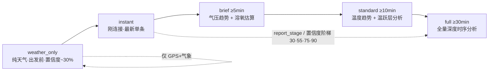
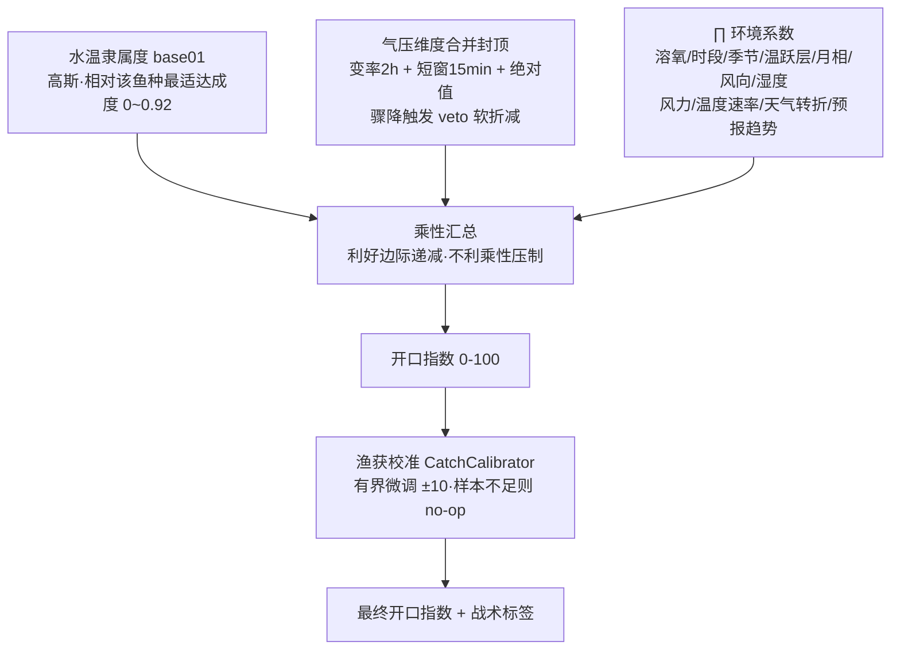
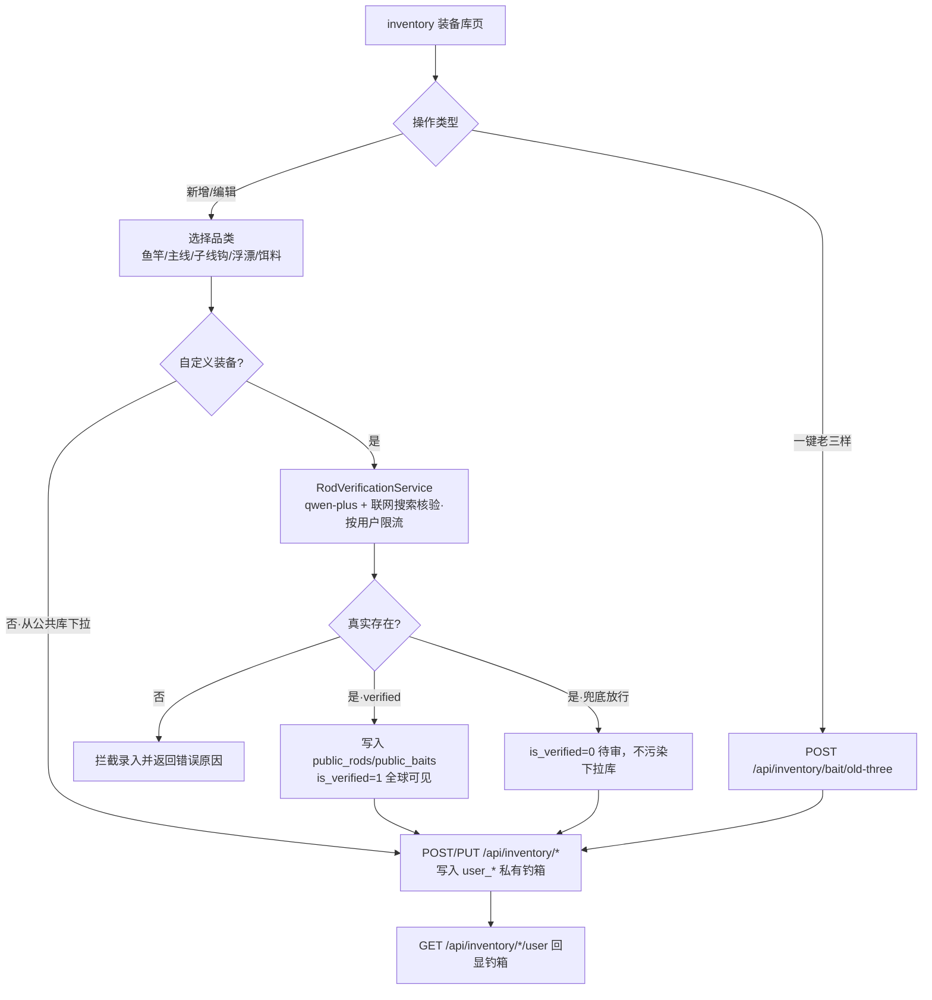
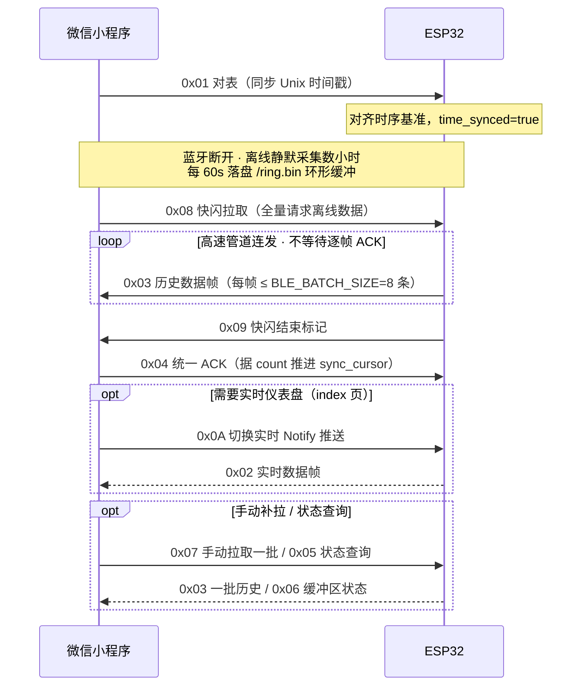

# AI 智能钓鱼助手 · 业务流程图

> 基于「三次握手 + 反馈闭环」的软硬一体野钓决策业务流程。
> 角色：钓鱼人(U) · 微信小程序(MP) · ESP32 感知硬件(HW) · FastAPI 后台(Server) · 通义千问大模型(LLM)。
>
> 硬件版本 v2：**单探头水温（DS18B20）+ 气温/气压（BMP280）**。
> 服务端由「单水温 + 气温」按热力学加权反演出表/中/底三层参考温度，无需多探头硬件。

---

## 一、全流程主干流程图（含分支决策）

```mermaid
flowchart TD
    Start([钓鱼人准备出钓]) --> Login[/小程序静默登录 wx.login 取 code<br/>POST /api/login → 服务端签发随机会话令牌 token/]
    Login -.token 存本地，后续请求带 X-Token 头鉴权.-> GPS

    %% ===== 阶段一：出钓筹备 =====
    subgraph P1[阶段一 · 出钓筹备期 — 纯天气前置预测]
        Login --> GPS[GPS 定位 + 当前时间<br/>wx.getLocation]
        GPS --> WX[后端拉取和风天气<br/>实时/逐时/3天 + 气压/风/温/湿]
        WX --> PW[POST /api/predict/weather<br/>9 鱼种全跑分 → 开口指数 0-100 + 排行榜]
        PW --> FC[GET /api/forecast/today 24h 逐小时<br/>GET /api/forecast/3day 三天日历]
        FC --> Card1[decision 页渲染开口指数<br/>+ 战术建议 + 最佳出钓窗口]
        Card1 --> Q1{今日适合出钓?}
    end
    Q1 -->|否· 评分低/有风险| Wait[改期 / 仅做装备准备]
    Wait --> End0([结束])
    Q1 -->|是| Go[前往钓点]

    %% ===== 第一次握手 =====
    subgraph H1[第一次握手 · 出钓开局配置 Setup]
        Go --> Setup[setup 页：选目标鱼/钓法<br/>勾选本次带出的装备]
        Setup --> NeedAdd{录入新竿/饵料?}
        NeedAdd -->|是·自定义| Verify[RodVerificationService<br/>qwen-plus + 联网搜索核验 · 按用户限流]
        Verify --> VOK{真实存在?}
        VOK -->|否| Reject[拦截录入并提示原因] --> Setup
        VOK -->|是| SaveBox[写入 user_rods 私有钓箱<br/>同步 public_rods 公共库]
        NeedAdd -->|否| Connect
        SaveBox --> Connect[BLE 秒连 ESP32]
        Connect --> Sync[下发对表指令 0x01<br/>同步 Unix 时间戳]
        Sync --> Ack1[HW 完成对表，时序基准对齐]
    end

    %% ===== 阶段二：硬件自治采集 =====
    Ack1 --> Drop[硬件沉入水底<br/>蓝牙断开·手机入袋]
    subgraph P2[阶段二 · 硬件常驻自治采集]
        Drop --> Collect[每 60 秒采集一次<br/>DS18B20 水温 + BMP280 气温/气压]
        Collect --> Ring[写入 Flash 环形缓冲<br/>/ring.bin · 36h 容量 · 防断电]
        Ring --> Keep[keepalive_sleep 切片睡眠<br/>激进 WiFi 保活防充电宝断电]
        Keep --> More{继续作钓?}
        More -->|是| Collect
    end

    %% ===== 第二次握手 =====
    More -->|遇鱼情突变/想看结果| Trigger
    subgraph H2[第二次握手 · AI 鱼情救场 Rescue]
        Trigger[rescue 页：勾选主观症状<br/>跑泡不咬/杂鱼截口/突然停口…] --> Reconn[BLE 自动重连]
        Reconn --> Dump[发送快闪拉取 0x08]
        Dump --> Flash[HW 高速连发历史帧 0x03<br/>结束标记 0x09]
        Flash --> Ack2[MP 统一回 ACK 0x04，推进同步游标]
        Ack2 --> Upload[POST /api/sensor/history 落库<br/>+ POST /api/v2/rescue]
        Upload --> Engine[domain/engine.py 时序求导<br/>判定 ΔP 趋势 + 温跃层 + 均值]
        Engine --> Tags[打物理特征标签<br/>STATUS_PRESSURE_CRASH 等]
        Tags --> RAG[RAG 召回 Top-K 大师秘籍<br/>master_kb.jsonl]
        RAG --> CallLLM[调用 LLM：30 年老钓手<br/>融合特征+主观症状+钓箱+秘籍]
        CallLLM --> Rx[返回结构化战术处方]
        Rx --> Show[小程序弹出改钓处方卡片]
    end
    Show --> Adjust[钓鱼人按处方纠偏<br/>推漂/换饵/改钓层]
    Adjust --> Again{需再次纠偏?}
    Again -->|是| Trigger

    %% ===== 第三次握手 + 反馈闭环 =====
    Again -->|否·收竿| Finish
    subgraph H3[第三次握手 · 收竿存档与反馈闭环]
        Finish[结束作钓] --> SaveSession[POST /api/session/save<br/>聚合全天时序会话摘要]
        SaveSession --> Poster[GET /api/v2/poster/:id<br/>据 bite_index_avg 判定渔获等级合成战报]
        SaveSession --> CatchLog[catch-log 页：POST /api/catch/log<br/>记录真实渔获作为校准样本]
        Card1 -.对预测点赞/拍砖.-> FB[POST /api/predict/feedback<br/>预测准不准 轻反馈]
    end
    Poster --> End([完成本次作钓周期])
    CatchLog -.离线 scripts/calibration_report.py 聚合.-> Cal[(calibration_stats.json<br/>回流校准开口指数)]
```

---

## 二、计算模式递进（数据越多越准）



> 报告阶段由 `domain/time_utils.py` 按累计采样时长判定，置信度与阶段名严格对齐（`get_confidence_staged`）。
> 单水温硬件下温跃层维度自动跳过（标记 `THERMOCLINE_SINGLE_SENSOR`），不影响其它因子。

---

## 三、开口指数合成模型（乘性归一）

> 核心算法在 `domain/services.py::FishingPredictionService`。彻底取代旧加法模型，
> 解决「因子未归一、气压重复计权、水温边界断崖」三大结构缺陷。



---

## 四、数字钓箱装备管理（跨阶段独立子流程）

> 装备库通过 `inventory` 标签页 + `add-*` 页面**独立维护**，不依赖某次出钓；
> 既可在出钓前筹备，也可在开局/救场时临时补录。其产出会作为上下文注入预测与 LLM 处方。



---

## 五、关键节点与接口

| 阶段 | 触发动作 | 核心接口 | 输出 |
|---|---|---|---|
| 出钓筹备 | 开屏定位 | `POST /api/predict/weather`、`GET /api/forecast/today\|3day` | 纯天气开口指数 + 排行榜 + 最佳窗口 |
| 第一次握手 (Setup) | 选鱼/钓法/对表 | `inventory/*`、BLE `0x01` | 装备/线组开局建议，硬件对时 |
| 自治采集 | 硬件入水 | —（HW 本地 RingBuffer，每 60s 一条） | 水温/气温/气压时序落盘 |
| 第二次握手 (Rescue) | 勾选主观症状 | BLE `0x08`→`0x03`/`0x09`→`0x04`、`POST /api/v2/rescue` | LLM 战术处方卡片 |
| 第三次握手 (收竿) | 结束作钓 | `POST /api/session/save`、`GET /api/v2/poster/{id}` | 会话摘要 + 战报海报 |
| 反馈闭环 | 记录渔获 / 评价预测 | `POST /api/catch/log`、`POST /api/predict/feedback` | 校准样本 + 质量信号 |

> 设计原则：**硬规则归引擎，模糊判断归大模型**。所有数学运算（开口指数合成、ΔP 变率、温跃层、溶氧、月相）由 `domain/services.py` / `engine.py` / `analyzers.py` 本地完成并打标签，LLM 仅负责融合特征与主观症状生成可执行处方。

---

## 六、数据落库映射

| 业务步骤 | 写入 / 读取接口 | 落库表 | 说明 |
|---|---|---|---|
| 登录 | `POST /api/login` | `users` | 记录 openid + 签发会话令牌（openid 不下发前端） |
| 传感器预测 | `POST /api/predict` | `prediction_history`* | 天气快照 + 标签 + 战术建议 + 月相 |
| 纯天气预测 | `POST /api/predict/weather` | —（无状态计算，不落库） | 出发前决策，允许匿名 |
| 实时/批量上报 | `POST /api/sensor/realtime`、`/api/sensor/history` | `sensor_records`* | 水温 + 气温 + 气压时序流水 |
| 趋势恢复 | `GET /api/sensor/records` | `sensor_records` | 小程序重启后恢复趋势图 |
| 收竿存档 | `POST /api/session/save` | `fishing_sessions` | 聚合时序统计 + 装备快照 |
| 战报海报 | `GET /api/v2/poster/{id}` | `fishing_sessions`(读) | 据 bite_index_avg 判定渔获等级 |
| AI 救场 | `POST /api/v2/rescue` | —（无状态实时计算，不落库） | 需登录 + 限流 10 次/小时 |
| 装备录入 | `inventory/*` | `user_*` / `public_*` | 私有钓箱 + 众包公共库 |
| 渔获记录 | `POST /api/catch/log` | `catch_logs` | 真实渔获 + 当时预测/环境快照，仅作校准样本 |
| 预测反馈 | `POST /api/predict/feedback` | `prediction_feedback` | 准/不准轻反馈，仅作质量信号 |
| 历史日记 | `GET /api/history/logs`、`/api/session/list`、`/api/catch/list` | `prediction_history`、`fishing_sessions`、`catch_logs` | 数字钓鱼日记回看 |

> \* 仅在携带有效 `X-Token`（登录态）时落库；匿名请求只返回计算结果不落库。
> `catch_logs` / `prediction_feedback` **均不参与运行时预测**，渔获仅经离线脚本聚合后做有界校准。

---

## 七、BLE 快闪同步协议时序（硬件 ↔ 小程序）



> 指令码定义见 `esp32/config.py`，编解码见 `esp32/ble/protocol.py`，连接与分发见 `esp32/ble/service.py`。
> 快闪 Dump 为**批量管道快拉**（连发不停等），由 `process_fast_dump()` 在主循环 tick 中分批推送，
> 全部发完才发 `0x09`，小程序据 `0x09` 后一次性 `0x04` 统一确认并滑动同步游标，秒级完成数小时数据同步。
